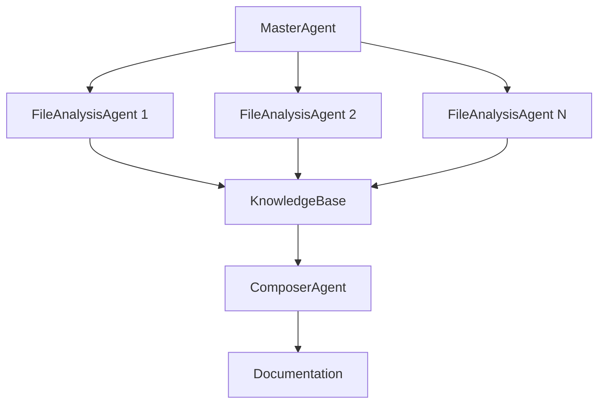

# CodeInspector 🔍

Мультиагентная система автоматического анализа программного кода, построенная на базе OpenAI Agents SDK. Система использует несколько специализированных агентов для глубокого анализа структуры проекта, генерации документации и создания архитектурных диаграмм.

## ✨ Особенности

- **Мультиагентная архитектура**: специализированные агенты для разных аспектов анализа
- **Поддержка множества языков**: Python, JavaScript, TypeScript, Java, C/C++, Go, Rust и другие
- **Гибкая конфигурация LLM**: поддержка OpenRouter и локальных моделей через LM Studio
- **AST-анализ**: глубокий структурный анализ кода с минимальным использованием контекста LLM
- **Автоматическая документация**: генерация Markdown документации с диаграммами
- **Анализ зависимостей**: построение графов межмодульных связей
- **Масштабируемость**: параллельная обработка файлов

## 🏗️ Архитектура

Система состоит из трех основных типов агентов:

1. **MasterAgent** (Мастер-агент) - координирует весь процесс анализа
2. **FileAnalysisAgent** (Агент анализа файлов) - анализирует отдельные файлы кода
3. **ComposerAgent** (Агент-композитор) - генерирует финальную документацию



## 📋 Требования

- Python 3.8+
- API ключ OpenRouter ИЛИ локально установленный LM Studio
- Зависимости из `requirements.txt`

## 🚀 Установка

1. **Клонируйте репозиторий и перейдите в директорию**:
```bash
cd examples/CodeInspector
```

2. **Установите зависимости**:
```bash
pip install -r requirements.txt
```

3. **Настройте провайдер LLM**:

### Вариант A: OpenRouter (рекомендуется)
```bash
export OPENROUTER_API_KEY="your-api-key-here"
```

### Вариант B: LM Studio (локальные модели)
```bash
# Запустите LM Studio и загрузите модель
# По умолчанию используется http://localhost:1234/v1
export LMSTUDIO_BASE_URL="http://localhost:1234/v1"
```

## 📖 Использование

### Базовый анализ

```bash
python main.py /path/to/your/project
```

### Расширенные опции

```bash
# Указать кастомную конфигурацию
python main.py --config custom_config /path/to/project

# Указать директорию для результатов
python main.py --output custom_output /path/to/project

# Подробный вывод
python main.py --verbose /path/to/project
```

### Примеры

```bash
# Анализ Python проекта
python main.py ../basic

# Анализ с сохранением в специфическую папку
python main.py --output reports ../customer_service

# Анализ с подробным выводом
python main.py -v ../financial_research_agent
```

## ⚙️ Конфигурация

### models.yaml
Настройка моделей для каждого типа агента:

```yaml
# Мастер-агент (планирование и координация)
master_agent:
  provider: openrouter  # или lmstudio
  model: anthropic/claude-3.5-sonnet
  settings:
    temperature: 0.1
    max_tokens: 2000

# Агент анализа файлов
file_analysis_agent:
  provider: openrouter
  model: google/gemini-2.0-flash-exp
  settings:
    temperature: 0.3
    max_tokens: 4000

# Агент-композитор документации
composer_agent:
  provider: openrouter
  model: anthropic/claude-3.5-sonnet
  settings:
    temperature: 0.3
    max_tokens: 4000
```

### settings.yaml
Общие настройки анализа:

```yaml
# Игнорируемые директории
ignore_directories:
  - __pycache__
  - .git
  - node_modules
  - .venv
  - dist
  - build

# Игнорируемые файлы
ignore_files:
  - "*.pyc"
  - "*.log"
  - ".DS_Store"

# Настройки анализа
analysis:
  max_depth: 10
  max_file_size_kb: 500
  max_concurrent_agents: 5
  max_files_per_batch: 50
```

## 📁 Структура результатов

После анализа в папке `output/` (или указанной) будут созданы:

```
output/
├── analysis_report.md      # Основной отчет с документацией
├── knowledge_base.json     # База знаний в JSON формате
└── project_analysis.md     # Дополнительный Markdown отчет
```

### Содержание отчета

- **Обзор проекта**: общее описание и статистика
- **Архитектура**: структура модулей и их взаимодействие
- **Граф зависимостей**: визуализация связей между компонентами
- **Детальный анализ файлов**: описание классов, функций и алгоритмов
- **Диаграммы**: Mermaid диаграммы для визуализации архитектуры

## 🔧 Поддерживаемые языки

- **Python** (.py)
- **JavaScript/TypeScript** (.js, .ts, .jsx, .tsx)
- **Java** (.java)
- **C/C++** (.c, .cpp, .h, .hpp)
- **Go** (.go)
- **Rust** (.rs)
- **PHP** (.php)
- **Ruby** (.rb)
- **C#** (.cs)
- **Swift** (.swift)
- **Kotlin** (.kt)

## 🎯 Примеры использования

### Анализ Python проекта

```bash
# Установите переменную окружения
export OPENROUTER_API_KEY="your-key"

# Запустите анализ
python main.py ../financial_research_agent

# Результат будет в output/analysis_report.md
```

### Использование с LM Studio

```bash
# Запустите LM Studio и загрузите модель (например, Qwen2.5-Coder)
# Убедитесь что сервер запущен на localhost:1234

# Настройте конфигурацию на использование LM Studio
# В config/models.yaml измените provider на 'lmstudio'

# Запустите анализ
python main.py /path/to/project
```

## 🚨 Устранение проблем

### Ошибки API

```bash
# Проверьте API ключ
echo $OPENROUTER_API_KEY

# Проверьте доступность LM Studio
curl http://localhost:1234/v1/models
```

### Ошибки парсинга

Если файл не может быть проанализирован:
- Проверьте поддержку языка в `parser/language_support.py`
- Убедитесь что файл не слишком большой (лимит в `settings.yaml`)
- Проверьте права доступа к файлу

### Проблемы с памятью

Для больших проектов:
- Уменьшите `max_concurrent_agents` в настройках
- Уменьшите `max_files_per_batch`
- Увеличьте `max_file_size_kb` для исключения больших файлов

## 🤝 Вклад в развитие

1. Форкните репозиторий
2. Создайте ветку для новой функции
3. Внесите изменения
4. Создайте Pull Request

### Добавление нового языка

1. Добавьте расширения в `parser/language_support.py`
2. При необходимости настройте AST парсер в `parser/ast_parser.py`
3. Обновите документацию

### Добавление нового агента

1. Создайте класс агента в `agents/`
2. Добавьте его в `agents/__init__.py`
3. Интегрируйте в `MasterAgent`

## 📄 Лицензия

MIT License

## 🙋‍♂️ Поддержка

Если у вас возникли вопросы или проблемы:
1. Проверьте документацию
2. Посмотрите примеры в репозитории
3. Создайте Issue с описанием проблемы

## 🚀 Дорожная карта

- [ ] Поддержка дополнительных форматов вывода (HTML, PDF)
- [ ] Интеграция с Git для анализа изменений
- [ ] Веб-интерфейс для интерактивного анализа
- [ ] Поддержка пользовательских плагинов
- [ ] Анализ качества и безопасности кода
- [ ] Интеграция с CI/CD системами
