# Анализ проекта - CodeInspector

*Анализ выполнен: 2025-06-28T15:08:52.502888*

## Обзор проекта

- **Путь**: .
- **Всего файлов**: 15
- **Всего строк кода**: 3,159

### Архитектура

Многомодульный проект с разделением по функциональности.

## Статистика по языкам

| Язык | Файлов | Строк | Классов | Функций |
|------|--------|-------|---------|---------|
| python | 15 | 3,159 | 12 | 11 |

## Граф зависимостей

```mermaid
graph TD
    node___init__ --> node_master_agent
    node___init__ --> node_file_analysis_agent
    node___init__ --> node_composer_agent
    node___init__ --> node_knowledge_base
    node_main --> node_pathlib
    node_main --> node_argparse
    node_main --> node_yaml
    node_main --> node_traceback
    node_main --> node_tree_sitter
    node_main --> node_src_agents_tracing
    node_main --> node_asyncio
    node_main --> node_sys
    node_main --> node_os
    node_main --> node_src_agents
    node_main --> node_agents
    node___init__ --> node_language_support
    node___init__ --> node_ast_parser
    node_main --> node_utils
    node_test_main --> node_pytest
    node_test_main --> node_main
    node_test_main --> node_utils
    node_composer_agent --> node_core
    node_composer_agent --> node_datetime
    node_composer_agent --> node_src_agents
    node_composer_agent --> node___future__
    node_composer_agent --> node_src
    node_composer_agent --> node_typing
    node_composer_agent --> node_os
    node_composer_agent --> node_src_agents_models
    node_composer_agent --> node_src_agents_models
    node_file_analysis_agent --> node_re
    node_file_analysis_agent --> node_parser
    node_file_analysis_agent --> node_core
    node_file_analysis_agent --> node_src_agents
    node_file_analysis_agent --> node___future__
    node_file_analysis_agent --> node_parser
    node_file_analysis_agent --> node_typing
    node_file_analysis_agent --> node_asyncio
    node_file_analysis_agent --> node_os
    node_file_analysis_agent --> node_src
    node_file_analysis_agent --> node_src_agents_models
    node_file_analysis_agent --> node_src_agents_models
    node_file_analysis_agent --> node_src_agents_models
    node_master_agent --> node_pathlib
    node_master_agent --> node_time
    node_master_agent --> node_agents
    node_master_agent --> node_core
    node_master_agent --> node_datetime
    node_master_agent --> node_src_agents
    node_master_agent --> node_yaml
    node_master_agent --> node_agents
    node_master_agent --> node___future__
    node_master_agent --> node_asyncio
    node_master_agent --> node_typing
    node_master_agent --> node_os
    node_master_agent --> node_src
    node_master_agent --> node_parser
    node_master_agent --> node_src_agents_models
    node_master_agent --> node_src_agents_models
    node_knowledge_base --> node_pathlib
    node_knowledge_base --> node_yaml
    node_knowledge_base --> node_json
    node_knowledge_base --> node___future__
    node_knowledge_base --> node_typing
    node_knowledge_base --> node_os
    node_knowledge_base --> node_dataclasses
    node_ast_parser --> node_re
    node_ast_parser --> node_pathlib
    node_ast_parser --> node___future__
    node_ast_parser --> node_typing
    node_ast_parser --> node_language_support
    node_ast_parser --> node_ast
    node_ast_parser --> node_dataclasses
    node_language_support --> node_pathlib
    node_language_support --> node___future__
    node_language_support --> node_typing
    node_test_agents --> node_pathlib
    node_test_agents --> node_agents
    node_test_agents --> node_core
    node_test_agents --> node_yaml
    node_test_agents --> node_agents
    node_test_agents --> node_tempfile
    node_test_agents --> node_asyncio
    node_test_agents --> node_sys
    node_test_agents --> node_os
    node_test_agents --> node_shutil
    node_test_agents --> node_typing
    node_test_agents --> node_agents
    node_utils --> node_re
    node_utils --> node_typing
```

## Анализ файлов

### agents\__init__.py

- **Язык**: python
- **Размер**: 10 строк
- **Описание**: Файл `__init__.py` используется для инициализации модуля и предоставления доступа к основным классам и агентам проекта, таким как `MasterAgent`, `FileAnalysisAgent` и `ComposerAgent`. Он позволяет удобно импортировать эти классы из модуля.

**Импорты:**
- from master_agent import MasterAgent
- from file_analysis_agent import FileAnalysisAgent
- from composer_agent import ComposerAgent

### agents\composer_agent.py

- **Язык**: python
- **Размер**: 414 строк
- **Описание**: Файл `composer_agent.py` реализует класс `ComposerAgent`, который, вероятно, управляет логикой составления или обработки композиций (например, музыкальных или структурных) в проекте. Он использует типы и модули для работы с данными и датами, обеспечивая функциональность агента, связанного с процессом создания композиций.

**Классы:**
- `ComposerAgent`: Класс `ComposerAgent` предназначен для сборки и оформления документации проекта, объединяя различные разделы и элементы в готовый формат. Он использует внутренние методы для генерации конфигурационных и языковых секций, а также для обработки нодов документации.

**Импорты:**
- from __future__ import annotations
- os
- from datetime import datetime
- from typing import Dict
- from typing import List
- *...и еще 9 импортов*

### agents\file_analysis_agent.py

- **Язык**: python
- **Размер**: 441 строк
- **Описание**: Файл `file_analysis_agent.py` реализует класс `FileAnalysisAgent`, который, вероятно, отвечает за анализ файлов в проекте, используя асинхронные операции и регулярные выражения. Он служит как модуль для обработки и анализа содержимого файлов в асинхронном режиме.

**Классы:**
- `FileAnalysisAgent`: Класс `FileAnalysisAgent` предназначен для анализа содержимого отдельного файла исходного кода, выделяя и обрабатывая элементы, такие как классы и функции. Он содержит методы для проверки типа файла, извлечения кода классов и функций, а также анализа качества кода.

**Импорты:**
- from __future__ import annotations
- asyncio
- os
- re
- from typing import Dict
- *...и еще 14 импортов*

### agents\master_agent.py

- **Язык**: python
- **Размер**: 525 строк
- **Описание**: Файл `master_agent.py` реализует класс `MasterAgent`, который, вероятно, управляется основной логикой приложения, обеспечивая координацию между различными компонентами системы. Он использует асинхронные операции и взаимодействует с внешними ресурсами через модули `os` и `datetime`.

**Классы:**
- `MasterAgent`: Класс `MasterAgent` представляет основной агент системы CodeInspector, отвечающий за загрузку конфигурации, группировку файлов по модулям и подготовку данных для анализа. Его методы обеспечивают инициализацию, настройку параметров и обработку структуры входных файлов.

**Импорты:**
- from __future__ import annotations
- asyncio
- os
- time
- from datetime import datetime
- *...и еще 19 импортов*

### core\__init__.py

- **Язык**: python
- **Размер**: 8 строк
- **Описание**: Файл `__init__.py` используется для инициализации модуля и предоставления доступа к ключевым классам и объектам из модуля `knowledge_base`, такие как `KnowledgeBase`, `FileAnalysisReport` и `ProjectAnalysis`. Он позволяет удобно импортировать и использовать эти элементы в других частях проекта.

**Импорты:**
- from knowledge_base import KnowledgeBase
- from knowledge_base import FileAnalysisReport
- from knowledge_base import ProjectAnalysis

### core\knowledge_base.py

- **Язык**: python
- **Размер**: 286 строк
- **Описание**: Файл `knowledge_base.py` реализует структуру данных для хранения и анализа знаний, включая классы для отчётов по файлам, проектам и базе знаний. Он служит основой для организации и обработки информации в проекте.

**Классы:**
- `FileAnalysisReport`: Класс `FileAnalysisReport` используется для хранения и обработки информации о анализе исходного кода файла. Основной алгоритм — сбор и структурирование данных о файле, его структуре, зависимостях и проблемах. Особенности: содержит поля для хранения пути к файлу, языка, количества строк, классов, функций, импортов, зависимостей, общей информации и заметок по сложности.
- `ProjectAnalysis`: Класс `ProjectAnalysis` используется для сбора и анализа информации о проекте. Основной алгоритм — это сбор статистики по файлам, строкам кода, языкам, точкам входа, зависимостям и архитектуре. Особенности: он хранит данные в виде атрибутов, использует дескрипторы для инициализации сложных типов, подходит для дальнейшей обработки и отчётов.
- `KnowledgeBase`: Класс `KnowledgeBase` служит центральной базой знаний системы CodeInspector, обеспечивая хранение и управление информацией о файлах, проектах и зависимостях. Он позволяет добавлять файлы, получать их данные и управлять анализом проектов.

**Импорты:**
- from __future__ import annotations
- json
- os
- from dataclasses import dataclass
- from dataclasses import field
- *...и еще 6 импортов*

### main.py

- **Язык**: python
- **Размер**: 180 строк
- **Описание**: Файл `main.py` служит основным точкой входа в приложение, где обрабатываются аргументы командной строки и проверяются зависимости. Он обеспечивает запуск программы с определёнными параметрами и взаимодействие с файловой системой.

**Функции:**
- `check_dependencies`: Функция `check_dependencies` проверяет наличие необходимых библиотек (`yaml`, `tree_sitter`). Основной алгоритм — попытка импорта модулей и вывод сообщения об ошибке, если они отсутствуют. Особенность — использование исключения для обработки отсутствия зависимостей.

**Импорты:**
- asyncio
- argparse
- os
- sys
- from pathlib import Path
- *...и еще 7 импортов*

### parser\__init__.py

- **Язык**: python
- **Размер**: 17 строк
- **Описание**: Файл `__init__.py` используется для инициализации модуля и объявления основных классов и объектов, необходимых для работы с аст-структурой кода. Он обеспечивает доступ к ключевым компонентам анализа исходного кода, таким как парсеры и поддержку языков.

**Импорты:**
- from ast_parser import ASTParser
- from ast_parser import CodeStructure
- from ast_parser import CodeFunction
- from ast_parser import CodeClass
- from language_support import LanguageSupport
- *...и еще 2 импортов*

### parser\ast_parser.py

- **Язык**: python
- **Размер**: 543 строк
- **Описание**: Файл `ast_parser.py` реализует парсер абстрактных синтаксических деревьев (AST) для анализа исходного кода на языке Python, позволяя извлекать структуру программ и метаданные о функциях, классах и других элементах. Он служит основой для инструментов, работающих с анализом и преобразованием кода.

**Классы:**
- `CodeFunction`: Класс `CodeFunction` используется для представления функции в коде с метаданными. Он хранит имя, номера строк, параметры, тип возвращаемого значения, документацию, сложность, флаг метода и видимость. Основной алгоритм — сбор и хранение информации о функции, а особенности включают возможность указания уровня доступности и анализа сложности.
- `CodeClass`: Класс `CodeClass` представляет собой структуру для хранения информации о классе в коде. Он содержит имя, начальную и конечную строки, методы, свойства, наследование и документацию, позволяя моделировать и анализировать исходный код. Основной алгоритм — сбор и хранение метаданных класса для последующего использования в инструментах анализа или генерации кода. Особенности включают использование типов (например, `List`, `Optional`) и атрибутов для описания структуры класса.
- `CodeStructure`: Класс `CodeStructure` описывает структуру кода файла, храня информацию о пути, языке, импортах, классах, функциях, глобальных переменных, зависимостях и сложности. Основной алгоритм — сбор и хранение метаданных о структуре исходного кода для анализа или отчётов. Особенность — использование типизированных полей для точного представления данных.
- `ASTParser`: Класс `ASTParser` предназначен для анализа исходного кода и извлечения структурной информации, таких как импорты и классы. Он использует парсер Python для преобразования кода в абстрактное синтаксическое дерево (AST).

**Импорты:**
- from __future__ import annotations
- ast
- re
- from dataclasses import dataclass
- from pathlib import Path
- *...и еще 6 импортов*

### parser\language_support.py

- **Язык**: python
- **Размер**: 304 строк
- **Описание**: Файл `language_support.py` реализует поддержку различных языков в проекте, предоставляя функции для фильтрации и сканирования кодовых файлов. Он используется для работы с файлами на разных языках программирования, обеспечивая структурированный доступ и обработку исходников.

**Классы:**
- `LanguageSupport`: Класс `LanguageSupport` предназначен для управления поддержкой различных языков программирования, предоставляя методы для определения языка, получения информации о нем и проверки его поддержки. Он используется для работы с синтаксисом и анализом кода на разных языках.

**Функции:**
- `filter_code_files`: Функция `filter_code_files` фильтрует список файлов, оставляя только те, которые являются исходными кодами и не соответствуют игнорируемым паттернам. Основной алгоритм: проверяет каждый файл на поддержку языка и соответствие паттернам, игнорирующим определённые типы файлов. Особенность — использование шаблонов для исключения неисходных кодовых файлов.
- `scan_directory`: Функция `scan_directory` сканирует директорию для файлов исходного кода, учитывая ограничение на глубину и игнорируя определённые папки. Основной алгоритм — рекурсивный обход директории с проверкой поддержки языка и исключения запрещённых директорий. Особенности: ограничение глубины, игнорирование системных и неиспользуемых папок, обработка ошибок доступа.

**Импорты:**
- from __future__ import annotations
- from typing import Dict
- from typing import List
- from typing import Optional
- from pathlib import Path

### test_agents.py

- **Язык**: python
- **Размер**: 331 строк
- **Описание**: Файл `test_agents.py` содержит тесты для модуля с агентами, проверяющие их работу с кодом. Он используется для автоматической проверки логики и поведения агентов в различных сценариях.

**Классы:**
- `TestCodeInspectorAgents`: Класс `TestCodeInspectorAgents` предназначен для проведения тестирования агентов CodeInspector. Он содержит методы для инициализации, настройки тестовой среды, создания конфигурации и очистки после тестов.

**Импорты:**
- asyncio
- os
- sys
- tempfile
- shutil
- *...и еще 9 импортов*

### test_project\__init__.py

- **Язык**: python
- **Размер**: 7 строк
- **Описание**: Файл `__init__.py` используется для инициализации модуля в Python, позволяя импортировать классы и функции из этого модуля. Он также определяет публичные интерфейсы и может содержать инициализационный код для модуля.

### test_project\main.py

- **Язык**: python
- **Размер**: 25 строк
- **Описание**: Файл `main.py` служит точкой входа в приложение, где определена функция `main`, использующая утилиты из модуля `utils` для вычисления чисел Фибоначчи, проверки электронной почты и обработки данных. Он координирует выполнение основных логических блоков проекта.

**Функции:**
- `main`: Функция `main` запускает тестовое приложение CodeInspector, вызывая три функции: вычисление чисел Фибоначчи, проверку email и обработку данных. Основной алгоритм — последовательное выполнение этих тестовых операций для демонстрации работы модулей. Особенность — использование фиксированных входных данных для проверки логики функций.

**Импорты:**
- from utils import calculate_fibonacci
- from utils import validate_email
- from utils import process_data

### test_project\test_main.py

- **Язык**: python
- **Размер**: 39 строк
- **Описание**: Файл `test_main.py` содержит тесты для проверки работы основных функций проекта: вычисления последовательности Фибоначчи, валидации электронной почты, обработки данных и самой функции `main`. Он используется для автоматического тестирования логики приложения.

**Функции:**
- `test_calculate_fibonacci`: Функция `test_calculate_fibonacci` проверяет корректность реализации функции вычисления чисел Фибоначчи. Основной алгоритм — это проверка нескольких значений на входе с ожидаемыми результатами, что позволяет убедиться, что функция правильно работает для разных случаев. Особенности: тесты охватывают нулевой и единичный индексы, а также средний и больший диапазоны.
- `test_validate_email`: Функция `test_validate_email` проверяет корректность валидации email-адресов. Основной алгоритм — сравнение результатов вызова функции `validate_email` с ожидаемыми значениями (True для корректных, False для неправильных). Особенности: тесты проверяют разные варианты ввода, включая пустую строку.
- `test_process_data`: Функция `test_process_data` проверяет корректность работы функции `process_data`, утверждая, что при обработке списков чисел она возвращает список, где каждое число увеличено на 2. Основной алгоритм — это тестирование преобразования входных данных, особенности — проверка различных сценариев: положительные числа, отрицательные и пустой список.
- `test_main_function`: Функция `test_main_function` проверяет, будет ли выполняться основная функция `main()` без ошибок. Основной алгоритм — вызов `main()` в блоке try/except с проверкой на исключения. Особенность — использование библиотеки pytest для отчетности о результатах теста.

**Импорты:**
- pytest
- from main import main
- from utils import calculate_fibonacci
- from utils import validate_email
- from utils import process_data

### test_project\utils.py

- **Язык**: python
- **Размер**: 29 строк
- **Описание**: Файл `utils.py` содержит вспомогательные функции для обработки данных, включая вычисление чисел Фибоначчи, проверку электронной почты и обработку входных данных. Он используется для упрощения логики основного кода и обеспечивает общие утилиты для различных частей приложения.

**Функции:**
- `calculate_fibonacci`: Функция `calculate_fibonacci` вычисляет n-ое число Фибоначчи с использованием итеративного подхода. Основной алгоритм — последовательное вычисление чисел по формуле $ F(n) = F(n-1) + F(n-2) $, сохраняя только последние два значения для оптимизации памяти. Особенность — линейная сложность и эффективное использование ресурсов.
- `validate_email`: Функция `validate_email` проверяет, соответствует ли введённый адрес электронной почты стандартному формату. Основной алгоритм — использование регулярного выражения для совпадения строки с шаблоном email. Особенность — проверка только на формальный корректности, не учитывая существование такого адреса.
- `process_data`: Функция `process_data` фильтрует и умножает положительные числа из входного списка. Основной алгоритм — это списковое включение, где каждый элемент умножается на 2, если он положителен. Особенность — работа с числами разных типов (целыми и浮点).

**Импорты:**
- from typing import List
- from typing import Union
- re
