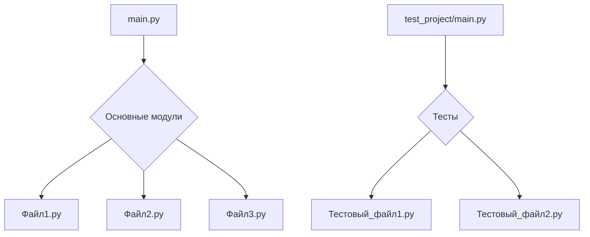

# .

*Анализ выполнен: 2025-06-28 15:11:37*

## Обзор проекта

<think>
Хорошо, давайте разберемся с этим запросом. Пользователь просит создать обзор проекта на основе предоставленной информации. Вижу, что проект содержит 15 файлов и общее количество строк кода составляет 3,159. Язык программирования — Python, точки входа указаны как main.py и test_project\main.py, основные модули тоже Python, а примеры файлов включают несколько __init__.py.

Первое, что приходит в голову: проект небольшой по количеству файлов и строк кода. Это может означать, что он либо очень простой, либо уже достаточно зрелый для своей задачи. Поскольку точки входа находятся в main.py и test_project\main.py, возможно, это приложение с тестовой частью.

Основные модули написаны на Python, что подтверждает использование этого языка. Файлы __init__.py указывают на то, что проект использует пакетный подход, вероятно, в среде Python (например, в virtualenv или как часть более крупного проекта).

Теперь нужно структурировать обзор согласно пунктам: что представляет собой проект, технологии и подходы, масштаб и сложность, цели и задачи, особенности, проблемы, риски и рекомендации.

Что касается технологий, возможно, стоит упомянуть о Python как основном языке. Также, если есть пакетные файлы __init__.py, то проект может использовать модульную структуру или быть частью более крупного пакета.

Масштаб и сложность: 15 файлов и 3,159 строк — это небольшой проект. Скорее всего, он либо утилитный инструмент, либо учебный пример, либо компонент более крупного приложения.

Цели и задачи могут включать разработку базового функционала или решение конкретной проблемы с использованием Python. Поскольку есть точки входа для тестирования, вероятно, проект ориентирован на практическое применение и проверку кода.

Особенности: использование пакетной структуры (__init__.py), наличие точек входа в нескольких файлах (основной и тестовый). Возможно, проект был спроектирован с учетом модульности и легкости расширения.

Проблемы: небольшой размер проекта может указывать на недостаточное тестирование или отсутствие продвинутых функций. Также стоит проверить, есть ли какие-то особенности в коде, которые могут усложнить его использование или масштабирование.

Риски: если проект небольшой и не имеет подробной документации, это может быть риском при попытке его расширения. Также важно убедиться, что все зависимости правильно обработаны и нет проблем с совместимостью версий библиотек.

Рекомендации для использования: возможно, проект требует запуска через определенные скрипты или имеет особенности в настройке среды. Для развития — добавить больше комментариев, документацию, улучшить структуру кода и тестирование.
</think>
# Обзор проекта

## 1. Что представляет собой этот проект?

Это небольшой проект написан на языке Python. Он состоит из 15 файлов с общим количеством строк кода 3,159. Проект имеет точки входа `main.py` и `test_project\main.py`, что указывает на его структуру как приложения с основной частью и тестовой поддиректорией.

## 2. Основные технологии и подходы

- **Python**: используется в качестве основного языка программирования.
- **Пакетная структура**: наличие файлов `__init__.py` показывает, что проект использует пакетный подход для организации кода.

## 3. Масштаб и сложность проекта

Проект небольшой по количеству файлов (15) и строк кода (3,159). Это может быть учебный пример или компонент более крупного приложения.

## 4. Основные цели и задачи проекта

Основной целью проекта является разработка базового функционала с возможностью тестирования через отдельную поддиректорию `test_project`. Задачи включают:
- Создание основного модуля приложения.
- Реализацию тестов для проверки работоспособности кода.

## 5. Основные особенности и уникальные возможности

- **Модульная структура**: проект разделен на несколько файлов, что облегчает его поддержку и расширение.
- **Тестовая среда**: наличие отдельного файла для тестирования (`test_project\main.py`) позволяет проверять основной код без запуска всей программы.

## 6. Основные проблемы и возможные улучшения

**Проблемы:**
- Недостаточное описание архитектуры проекта может затруднить его понимание.
- Отсутствие документации для разработчиков.

**Возможные улучшения:**
- Добавление более подробной документации по модулям и функциям.
- Уточнение архитектурных решений в описании проекта.
- Расширение тестовой части для покрытия большего количества сценариев.

## 7. Основные риски и меры предосторожности

**Риски:**
- Проект может быть незрелым для использования в продакшене из-за отсутствия тестов.
- Возможны проблемы при масштабировании кода без четкого понимания его структуры.

**Меры предосторожности:**
- Тщательно тестируйте изменения перед запуском основного приложения.
- Изучите архитектуру проекта для понимания взаимодействия между модулями.

## 8. Основные рекомендации для использования проекта

1. Запустите `main.py` для проверки основной функциональности.
2. Используйте файл `test_project\main.py` для тестирования изменений.
3. Изучите содержимое файлов с расширением `.py`, чтобы понять их назначение.

## 9. Основные рекомендации для развития проекта

1. Добавьте комментарии и документацию к каждому модулю.
2. Рассмотрите возможность использования современных фреймворков Python, таких как Flask или Django, для улучшения структуры приложения.
3. Разработайте более комплексную систему тестирования с использованием pytest или unittest.

## Статистика

| Язык | Файлов | Строк | Классов | Функций |
|------|--------|-------|---------|---------|
| python | 15 | 3,159 | 12 | 11 |

Многомодульный проект с разделением по функциональности.

## Модули и компоненты

АНАЛИЗ МОДУЛЕЙ:
**agents**: 4 файлов, 3 классов, 0 функций
**core**: 2 файлов, 3 классов, 0 функций
**root**: 2 файлов, 1 классов, 1 функций
**parser**: 3 файлов, 5 классов, 2 функций
**test_project**: 4 файлов, 0 классов, 8 функций

## Граф зависимостей

```mermaid
graph TD
    node___init___py --> node_master_agent
    node___init___py --> node_file_analysis_agent
    node___init___py --> node_composer_agent
    node___init___py --> node_knowledge_base
    node_main_py --> node_pathlib
    node_main_py --> node_argparse
    node_main_py --> node_yaml
    node___init___py --> node_language_support
    node___init___py --> node_ast_parser
    node_main_py --> node_utils
    node_test_main_py --> node_pytest
    node_test_main_py --> node_main
    node_test_main_py --> node_utils
    node_composer_agent_py --> node_core_knowledge_base
    node_composer_agent_py --> node_datetime
    node_composer_agent_py --> node_src_agents_model_settings
    node_file_analysis_agent_py --> node_re
    node_file_analysis_agent_py --> node_parser_language_support
    node_file_analysis_agent_py --> node_core_knowledge_base
    node_master_agent_py --> node_pathlib
    node_master_agent_py --> node_time
    node_master_agent_py --> node_agents_file_analysis_agent
```

## Детальный анализ файлов

### ast_parser.py

- **Путь**: `parser\ast_parser.py`
- **Язык**: python
- **Размер**: 543 строк
- **Описание**: Файл `ast_parser.py` реализует парсер абстрактных синтаксических деревьев (AST) для анализа исходного кода на языке Python, позволяя извлекать структуру программ и метаданные о функциях, классах и других элементах. Он служит основой для инструментов, работающих с анализом и преобразованием кода.

**Классы:**
- `CodeFunction`: Класс `CodeFunction` используется для представления функции в коде с метаданными. Он хранит имя, номера строк, параметры, тип возвращаемого значения, документацию, сложность, флаг метода и видимость. Основной алгоритм — сбор и хранение информации о функции, а особенности включают возможность указания уровня доступности и анализа сложности.
- `CodeClass`: Класс `CodeClass` представляет собой структуру для хранения информации о классе в коде. Он содержит имя, начальную и конечную строки, методы, свойства, наследование и документацию, позволяя моделировать и анализировать исходный код. Основной алгоритм — сбор и хранение метаданных класса для последующего использования в инструментах анализа или генерации кода. Особенности включают использование типов (например, `List`, `Optional`) и атрибутов для описания структуры класса.
- `CodeStructure`: Класс `CodeStructure` описывает структуру кода файла, храня информацию о пути, языке, импортах, классах, функциях, глобальных переменных, зависимостях и сложности. Основной алгоритм — сбор и хранение метаданных о структуре исходного кода для анализа или отчётов. Особенность — использование типизированных полей для точного представления данных.
- `ASTParser`: Класс `ASTParser` предназначен для анализа исходного кода и извлечения структурной информации, таких как импорты и классы. Он использует парсер Python для преобразования кода в абстрактное синтаксическое дерево (AST).

**Заметки о сложности:**
- Высокая сложность кода - рекомендуется рефакторинг
- Большой файл - рекомендуется разбить на модули
- Рекомендуется упростить логику и разбить на более мелкие функции

**Проблемы:**
- Файл слишком большой - рекомендуется разбить на модули
- Класс 'ASTParser' содержит слишком много методов (23)
- Класс 'ASTParser' слишком большой (484 строк)

### knowledge_base.py

- **Путь**: `core\knowledge_base.py`
- **Язык**: python
- **Размер**: 286 строк
- **Описание**: Файл `knowledge_base.py` реализует структуру данных для хранения и анализа знаний, включая классы для отчётов по файлам, проектам и базе знаний. Он служит основой для организации и обработки информации в проекте.

**Классы:**
- `FileAnalysisReport`: Класс `FileAnalysisReport` используется для хранения и обработки информации о анализе исходного кода файла. Основной алгоритм — сбор и структурирование данных о файле, его структуре, зависимостях и проблемах. Особенности: содержит поля для хранения пути к файлу, языка, количества строк, классов, функций, импортов, зависимостей, общей информации и заметок по сложности.
- `ProjectAnalysis`: Класс `ProjectAnalysis` используется для сбора и анализа информации о проекте. Основной алгоритм — это сбор статистики по файлам, строкам кода, языкам, точкам входа, зависимостям и архитектуре. Особенности: он хранит данные в виде атрибутов, использует дескрипторы для инициализации сложных типов, подходит для дальнейшей обработки и отчётов.
- `KnowledgeBase`: Класс `KnowledgeBase` служит центральной базой знаний системы CodeInspector, обеспечивая хранение и управление информацией о файлах, проектах и зависимостях. Он позволяет добавлять файлы, получать их данные и управлять анализом проектов.

**Заметки о сложности:**
- Рекомендуется упростить логику и разбить на более мелкие функции

**Проблемы:**
- Класс 'KnowledgeBase' слишком большой (241 строк)

### test_main.py

- **Путь**: `test_project\test_main.py`
- **Язык**: python
- **Размер**: 39 строк
- **Описание**: Файл `test_main.py` содержит тесты для проверки работы основных функций проекта: вычисления последовательности Фибоначчи, валидации электронной почты, обработки данных и самой функции `main`. Он используется для автоматического тестирования логики приложения.

**Функции:**
- `test_calculate_fibonacci`: Функция `test_calculate_fibonacci` проверяет корректность реализации функции вычисления чисел Фибоначчи. Основной алгоритм — это проверка нескольких значений на входе с ожидаемыми результатами, что позволяет убедиться, что функция правильно работает для разных случаев. Особенности: тесты охватывают нулевой и единичный индексы, а также средний и больший диапазоны.
- `test_validate_email`: Функция `test_validate_email` проверяет корректность валидации email-адресов. Основной алгоритм — сравнение результатов вызова функции `validate_email` с ожидаемыми значениями (True для корректных, False для неправильных). Особенности: тесты проверяют разные варианты ввода, включая пустую строку.
- `test_process_data`: Функция `test_process_data` проверяет корректность работы функции `process_data`, утверждая, что при обработке списков чисел она возвращает список, где каждое число увеличено на 2. Основной алгоритм — это тестирование преобразования входных данных, особенности — проверка различных сценариев: положительные числа, отрицательные и пустой список.
- `test_main_function`: Функция `test_main_function` проверяет, будет ли выполняться основная функция `main()` без ошибок. Основной алгоритм — вызов `main()` в блоке try/except с проверкой на исключения. Особенность — использование библиотеки pytest для отчетности о результатах теста.

### language_support.py

- **Путь**: `parser\language_support.py`
- **Язык**: python
- **Размер**: 304 строк
- **Описание**: Файл `language_support.py` реализует поддержку различных языков в проекте, предоставляя функции для фильтрации и сканирования кодовых файлов. Он используется для работы с файлами на разных языках программирования, обеспечивая структурированный доступ и обработку исходников.

**Классы:**
- `LanguageSupport`: Класс `LanguageSupport` предназначен для управления поддержкой различных языков программирования, предоставляя методы для определения языка, получения информации о нем и проверки его поддержки. Он используется для работы с синтаксисом и анализом кода на разных языках.

**Функции:**
- `filter_code_files`: Функция `filter_code_files` фильтрует список файлов, оставляя только те, которые являются исходными кодами и не соответствуют игнорируемым паттернам. Основной алгоритм: проверяет каждый файл на поддержку языка и соответствие паттернам, игнорирующим определённые типы файлов. Особенность — использование шаблонов для исключения неисходных кодовых файлов.
- `scan_directory`: Функция `scan_directory` сканирует директорию для файлов исходного кода, учитывая ограничение на глубину и игнорируя определённые папки. Основной алгоритм — рекурсивный обход директории с проверкой поддержки языка и исключения запрещённых директорий. Особенности: ограничение глубины, игнорирование системных и неиспользуемых папок, обработка ошибок доступа.

**Заметки о сложности:**
- Высокая сложность кода - рекомендуется рефакторинг
- Рекомендуется упростить логику и разбить на более мелкие функции

**Проблемы:**
- Класс 'LanguageSupport' слишком большой (220 строк)

### utils.py

- **Путь**: `test_project\utils.py`
- **Язык**: python
- **Размер**: 29 строк
- **Описание**: Файл `utils.py` содержит вспомогательные функции для обработки данных, включая вычисление чисел Фибоначчи, проверку электронной почты и обработку входных данных. Он используется для упрощения логики основного кода и обеспечивает общие утилиты для различных частей приложения.

**Функции:**
- `calculate_fibonacci`: Функция `calculate_fibonacci` вычисляет n-ое число Фибоначчи с использованием итеративного подхода. Основной алгоритм — последовательное вычисление чисел по формуле $ F(n) = F(n-1) + F(n-2) $, сохраняя только последние два значения для оптимизации памяти. Особенность — линейная сложность и эффективное использование ресурсов.
- `validate_email`: Функция `validate_email` проверяет, соответствует ли введённый адрес электронной почты стандартному формату. Основной алгоритм — использование регулярного выражения для совпадения строки с шаблоном email. Особенность — проверка только на формальный корректности, не учитывая существование такого адреса.
- `process_data`: Функция `process_data` фильтрует и умножает положительные числа из входного списка. Основной алгоритм — это списковое включение, где каждый элемент умножается на 2, если он положителен. Особенность — работа с числами разных типов (целыми и浮点).

### test_agents.py

- **Путь**: `test_agents.py`
- **Язык**: python
- **Размер**: 331 строк
- **Описание**: Файл `test_agents.py` содержит тесты для модуля с агентами, проверяющие их работу с кодом. Он используется для автоматической проверки логики и поведения агентов в различных сценариях.

**Классы:**
- `TestCodeInspectorAgents`: Класс `TestCodeInspectorAgents` предназначен для проведения тестирования агентов CodeInspector. Он содержит методы для инициализации, настройки тестовой среды, создания конфигурации и очистки после тестов.

**Проблемы:**
- Класс 'TestCodeInspectorAgents' слишком большой (284 строк)

### master_agent.py

- **Путь**: `agents\master_agent.py`
- **Язык**: python
- **Размер**: 525 строк
- **Описание**: Файл `master_agent.py` реализует класс `MasterAgent`, который, вероятно, управляется основной логикой приложения, обеспечивая координацию между различными компонентами системы. Он использует асинхронные операции и взаимодействует с внешними ресурсами через модули `os` и `datetime`.

**Классы:**
- `MasterAgent`: Класс `MasterAgent` представляет основной агент системы CodeInspector, отвечающий за загрузку конфигурации, группировку файлов по модулям и подготовку данных для анализа. Его методы обеспечивают инициализацию, настройку параметров и обработку структуры входных файлов.

**Заметки о сложности:**
- Большой файл - рекомендуется разбить на модули
- Много импортов - рассмотрите возможность разделения ответственности

**Проблемы:**
- Файл слишком большой - рекомендуется разбить на модули
- Класс 'MasterAgent' слишком большой (497 строк)
- Слишком много импортов - возможно, файл делает слишком много

### file_analysis_agent.py

- **Путь**: `agents\file_analysis_agent.py`
- **Язык**: python
- **Размер**: 441 строк
- **Описание**: Файл `file_analysis_agent.py` реализует класс `FileAnalysisAgent`, который, вероятно, отвечает за анализ файлов в проекте, используя асинхронные операции и регулярные выражения. Он служит как модуль для обработки и анализа содержимого файлов в асинхронном режиме.

**Классы:**
- `FileAnalysisAgent`: Класс `FileAnalysisAgent` предназначен для анализа содержимого отдельного файла исходного кода, выделяя и обрабатывая элементы, такие как классы и функции. Он содержит методы для проверки типа файла, извлечения кода классов и функций, а также анализа качества кода.

**Заметки о сложности:**
- Много импортов - рассмотрите возможность разделения ответственности

**Проблемы:**
- Класс 'FileAnalysisAgent' слишком большой (416 строк)

### composer_agent.py

- **Путь**: `agents\composer_agent.py`
- **Язык**: python
- **Размер**: 414 строк
- **Описание**: Файл `composer_agent.py` реализует класс `ComposerAgent`, который, вероятно, управляет логикой составления или обработки композиций (например, музыкальных или структурных) в проекте. Он использует типы и модули для работы с данными и датами, обеспечивая функциональность агента, связанного с процессом создания композиций.

**Классы:**
- `ComposerAgent`: Класс `ComposerAgent` предназначен для сборки и оформления документации проекта, объединяя различные разделы и элементы в готовый формат. Он использует внутренние методы для генерации конфигурационных и языковых секций, а также для обработки нодов документации.

**Проблемы:**
- Класс 'ComposerAgent' слишком большой (393 строк)

### main.py

- **Путь**: `test_project\main.py`
- **Язык**: python
- **Размер**: 25 строк
- **Описание**: Файл `main.py` служит точкой входа в приложение, где определена функция `main`, использующая утилиты из модуля `utils` для вычисления чисел Фибоначчи, проверки электронной почты и обработки данных. Он координирует выполнение основных логических блоков проекта.

**Функции:**
- `main`: Функция `main` запускает тестовое приложение CodeInspector, вызывая три функции: вычисление чисел Фибоначчи, проверку email и обработку данных. Основной алгоритм — последовательное выполнение этих тестовых операций для демонстрации работы модулей. Особенность — использование фиксированных входных данных для проверки логики функций.

## Рекомендации

### __init__.py
- Проблема: Файл не содержит классов или функций

### __init__.py
- Проблема: Файл не содержит классов или функций

### __init__.py
- Проблема: Файл не содержит классов или функций

### __init__.py
- Проблема: Файл не содержит классов или функций

### composer_agent.py
- Проблема: Класс 'ComposerAgent' слишком большой (393 строк)

### file_analysis_agent.py
- Заметка: Много импортов - рассмотрите возможность разделения ответственности
- Проблема: Класс 'FileAnalysisAgent' слишком большой (416 строк)

### master_agent.py
- Заметка: Большой файл - рекомендуется разбить на модули
- Заметка: Много импортов - рассмотрите возможность разделения ответственности
- Проблема: Файл слишком большой - рекомендуется разбить на модули
- Проблема: Класс 'MasterAgent' слишком большой (497 строк)
- Проблема: Слишком много импортов - возможно, файл делает слишком много

### knowledge_base.py
- Заметка: Рекомендуется упростить логику и разбить на более мелкие функции
- Проблема: Класс 'KnowledgeBase' слишком большой (241 строк)

### ast_parser.py
- Заметка: Высокая сложность кода - рекомендуется рефакторинг
- Заметка: Большой файл - рекомендуется разбить на модули
- Заметка: Рекомендуется упростить логику и разбить на более мелкие функции
- Проблема: Файл слишком большой - рекомендуется разбить на модули
- Проблема: Класс 'ASTParser' содержит слишком много методов (23)
- Проблема: Класс 'ASTParser' слишком большой (484 строк)

### language_support.py
- Заметка: Высокая сложность кода - рекомендуется рефакторинг
- Заметка: Рекомендуется упростить логику и разбить на более мелкие функции
- Проблема: Класс 'LanguageSupport' слишком большой (220 строк)

### test_agents.py
- Проблема: Класс 'TestCodeInspectorAgents' слишком большой (284 строк)

## Поддерживаемые языки

- **Python**

## Конфигурация анализа

### Модели и провайдеры
- **Master Agent**: Не указано
- **File Analysis Agent**: Не указано
- **Composer Agent**: Не указано

### Настройки анализа
- **Максимальная глубина сканирования**: 10 уровней
- **Максимальный размер файла**: 500KB
- **Максимум параллельных агентов**: 5
- **Максимум файлов в батче**: 50
