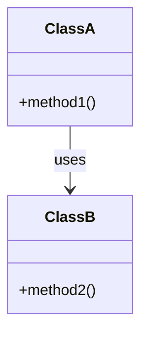

# Техническая спецификация: мультиагентная система анализа программного кода

## 1. Общая архитектура

Мультиагентная система предназначена для автоматического анализа произвольного программного проекта с помощью нескольких специализированных агентов. Система построена на базе Agents SDK (например, OpenAI Agents SDK) и работает локально на Windows/Linux, взаимодействуя с языковыми моделями (LLM) как локальными (через LM Studio), так и внешними (через OpenRouter). Основной принцип архитектуры – **разделение сложной задачи анализа кода на набор более простых подзадач**, выполняемых разными агентами. Вместо одного «монолитного» агента с огромным контекстом используются несколько узкоспециализированных агентов с малыми подсказками (prompt), что повышает эффективность и позволяет комбинировать различные модели. Агенты обмениваются информацией и совместно формируют целостное представление о проекте. Приоритет отдан использованию малых и средних языковых моделей (например, GPT-4.1-mini, Qwen-8B, Gemini 2.5B Flash) с минимальными затратами контекста, за счёт чего достигается высокая производительность при локальной работе системы.

**Основные компоненты архитектуры** включают центральный координирующий агент (мастер-агент) и множество вспомогательных агентов-анализаторов. Мастер-агент управляет выполнением плана: он автоматически **определяет шаги анализа проекта** (например, декомпозицию на файлы/модули, изучение структуры, генерацию документации, анализ алгоритмов) и распределяет эти подзадачи между агентами. Каждый агент-исполнитель отвечает за конкретный аспект: анализ отдельного файла или модуля, документирование определённой части кода, агрегирование знаний и т.д. Все агенты работают локально, используя системные ресурсы без контейнеризации (без Docker), что обеспечивает кроссплатформенность. Обращения к LLM сведены к необходимому минимуму и происходят через унифицированные интерфейсы: **LM Studio** используется для запуска моделей локально, а **OpenRouter** – для доступа к внешним API различных моделей (с единым API-ключом и выбором модели в параметрах запроса). Это позволяет гибко переключаться между моделью, запущенной на локальной машине, и облачными LLM, не меняя остальной логики системы.

&#x20;*Рис. 1: Блок-схема мультиагентной системы.* На диаграмме показан общий поток работы: пользователь инициирует анализ проекта, мастер-агент планирует задачи и параллельно запускает агентов для анализа файлов (File Analyzer Agents). Каждый агент-анализатор обрабатывает свой файл (или группу файлов) – извлекает структуру кода, обращается к LLM для получения описаний – и возвращает мастер-агенту результаты в виде структурированной информации. Мастер-агент затем передаёт собранные данные агенту-компоновщику документации (Documentation Composer Agent), который агрегирует знания, формирует документацию (Markdown-файлы, диаграммы) и обновляет центральную базу знаний проекта. В завершение мастер-агент предоставляет пользователю итоговый отчёт/документацию по анализируемому проекту.

Главной особенностью архитектуры является сочетание **глубокой специализации, параллельного выполнения и централизованной оркестрации**. Специализированные агенты выполняют каждую свою задачу лучше и с меньшим контекстом, чем один универсальный агент. Параллельная обработка файлов ускоряет анализ крупных проектов. Централизованная координация через мастер-агента обеспечивает прозрачность и контроль над общей логикой решения задачи. Результатом работы системы становится **централизованная база знаний** по проекту – набор Markdown-файлов, в которых задокументирована структура кода, логика работы ключевых модулей и алгоритмов, взаимосвязи компонентов. Эти файлы могут включать визуализации (например, диаграммы архитектуры, генерируемые с помощью HTML/JS или встроенных средств разметки), что упрощает изучение проекта. Таким образом, архитектура поддерживает **локальную автономную работу** (анализ производится на месте, без передачи исходного кода во внешние сервисы) при одновременном использовании возможностей LLM для генерации описаний и инсайтов о коде.

## 2. Модель координации агентов (мастер-агент vs peer-to-peer)

Для взаимодействия агентов предусмотрены два возможных подхода координации: **централизованный (иерархический)** с мастер-агентом и **децентрализованный (peer-to-peer)**. В данной системе основным выбран централизованный подход, однако архитектура гибкая и может быть расширена до peer-to-peer при необходимости.

**Централизованная координация (Master-Agent):** один агент выполняет роль главного **планировщика/диспетчера**. Этот мастер-агент обладает глобальным представлением о задаче и последовательности действий. Он не решает все подзадачи самостоятельно, а делегирует их специализированным подагентам, как будто вызывает инструменты. В таком режиме субагенты не инициируют произвольных коммуникаций между собой и не перехватывают общий контекст; вместо этого главный агент поочерёдно запрашивает их выполнить те или иные шаги и собирает результаты. **Единая нить управления** остаётся у мастер-агента, что упрощает координацию и гарантирует целостный взгляд на процесс решения задачи. Такой подход (известный как *“agent-as-a-tool”*) позволяет прозрачно отслеживать ход рассуждений системы, а также легко выполнять подзадачи параллельно. В контексте нашего приложения мастер-агент, получив запрос на анализ кода, планирует: например, "получить список файлов, запустить анализаторы по каждому, затем обобщить результаты". Он параллельно запускает группу агентов-аналитиков (по одному на файл или модуль), ожидает от них отчёты, затем объединяет их через агента-компоновщика. Централизованная модель удобна тем, что все результаты стекаются к одному центру (мастеру), где легко сформировать единую базу знаний.

**Децентрализованная координация (Peer-to-Peer):** отсутствует единый управляющий узел, агенты обмениваются данными более гибко и могут динамически перераспределять задачи. В простейшем случае это может реализовываться через механизм *handoff*, когда один агент по ходу решения передаёт управление другому, если распознает, что тот более компетентен для текущей подзадачи. Например, агент, просматривающий файл, может "позвать" другого агента для расшифровки сложного алгоритма и потом продолжить работу. В более сложной реализации все агенты могут общаться через общую шину или *«доску объявлений» (blackboard)*, публикуя обнаруженную информацию и подтаскивая новые задачи на основании появившихся данных. Такой peer-to-peer подход теоретически ближе к равноправному сообществу агентов, способному к самоорганизации. Его преимущество – гибкость и потенциально более творческое распределение работ, **не требующее жёсткого сценария**. Однако децентрализованная схема усложняет поддержание глобального видения процесса и может приводить к дополнительным накладным расходам на синхронизацию. В нашем случае peer-to-peer модель могла бы значить, что каждый агент знает о существовании других и сам решает, кому передать тот или иной фрагмент анализа. Например, агент, анализирующий код, обнаружив неизвестный файл, мог бы сам создать нового агента для его анализа. **Недостатки** такого подхода – более сложная отладка и непредсказуемость: без центрального планирования важно предотвращать ситуации, когда агенты дублируют работу или находятся в конфликте за ресурсы.

**Выбор модели:** для целевой реализации мы выбираем **централизованную координацию с мастер-агентом** как основную модель, поскольку она обеспечивает максимальный контроль над процессом и упрощает агрегирование результатов. Этот подход соответствует шаблону «hub-and-spoke» (звездообразная архитектура): главный агент играет роль концентратора, а специализированные агенты – «спицы», выполняющие работу и возвращающие результаты к центру. Такая структура наиболее предпочтительна для систематического анализа кода, где важно собрать все части мозаики воедино. Тем не менее, мы предусматриваем возможность расширения в сторону децентрализованности: при необходимости на базе Agents SDK можно внедрить мехнизм прямого общения агентов. Например, Agents SDK поддерживает передачу управления (handoff) между агентами, что можно использовать для реализации сценариев, где один агент динамически запускает другого. Кроме того, центральная база знаний может выступать в роли *«черной доски»*, куда каждый агент публикует свои результаты, а другие их читают – это позволит добавить элементы peer-to-peer взаимодействия, сохраняя при этом общий каркас системы.

В результате, модель координации в данной системе может быть описана как **иерархическая с возможностью децентрализованных расширений**. Мастер-агент планирует глобально и объединяет данные, а специализированные агенты решают локальные подзадачи. Такой подход доказал эффективность на практике: он используется, например, в финансовом аналитическом агенте OpenAI, где центральный агент-менеджер делегирует задачи экспертам по подсистемам. Мы придерживаемся этой парадигмы, поскольку она облегчает отслеживаемость процесса и масштабирование (добавление новых агентов-специалистов не нарушает работу остальных, они просто подключаются как новые «инструменты» главного агента).

## 3. Виды агентов и их поведение

Система включает несколько типов агентов, каждый из которых выполняет свою роль в рамках общего анализа. Ниже перечислены основные виды агентов и описание их поведения:

* **Мастер-агент (координатор / планировщик):** Главный агент, отвечающий за декомпозицию задачи и координацию других агентов. При запуске анализа нового проекта мастер-агент сканирует структуру проекта (например, получает список файлов и директорий, определяет языки программирования по расширениям). На основе этой информации он **автоматически формирует план** анализа. План может включать: а) анализ каждого исходного файла; б) объединение результатов по модулям; в) генерацию обзора архитектуры; г) выявление ключевых алгоритмов для детального разбора. Мастер-агент затем распределяет подзадачи между другими агентами – фактически выступая в роли **диспетчера задач**. Он запускает (или вызывает) агентов-анализаторов для каждого файла или группы файлов, передавая им необходимый контекст (например, путь к файлу, тип языка). Пока подчинённые агенты работают, мастер-агент может ожидать или выполнять другие координационные действия (например, собирать промежуточные данные, отслеживать прогресс). Когда все результаты собраны, мастер-агент передаёт их агенту-композитору (см. ниже) для финальной сборки документации. **Поведение:** мастер-агент придерживается стратегии минимизации обращений к LLM – он полагается на правила и статический анализ для планирования там, где возможно, и может лишь изредка обращаться к LLM для высокоуровневых решений (например, попросить сформулировать краткое описание проекта, зная названия модулей). В коммуникации с подагентами мастер-агент поддерживает централизованный **контекст задачи** (например, общую база знаний), куда складываются все частичные результаты.

* **Агент-аналитик файла (File Analyst Agent):** Специализированные агенты, каждый из которых занимается анализом одного исходного файла или логического модуля. Мастер-агент запускает множество таких агентов – по одному на каждый файл (в больших проектах возможно по одному на каждый модуль/пакет, если файлы мелкие). Получив от мастера указание (например, "проанализируй файл X"), агент-аналитик загружает содержимое исходного кода этого файла. **Его задача – понять структуру и смысл кода данного файла.** Для этого агент выполняет статический анализ: парсит исходник, извлекает синтаксическое дерево (AST), находит определения классов, функций, глобальных переменных, точки входа и т.д. (подробнее см. раздел алгоритмов анализа). Затем агент может обратиться к LLM для получения **семантической информации** – например, попросить кратко описать назначение обнаруженной функции или объяснить, что делает тот или иной алгоритм. Важный аспект: агент старается изолировать небольшие фрагменты кода для анализа LLM, чтобы не превышать контекст. Например, он поочерёдно отправит в LLM каждую функцию или логический блок и получит описание, вместо того чтобы отправлять весь файл целиком. По завершении обработки файла агент-аналитик формирует **отчёт о файле** – структурированные данные, включающие:

  * Список классов с их назначением (например, название класса и сгенерированное описание роли этого класса).
  * Список функций/методов с их кратким описанием (что делают, какие параметры, возвращаемое значение, важные особенности).
  * Зависимости файла: какие модули импортирует, какие глобальные ресурсы использует, какие файлы вызывают (по информации из статического анализа).
  * Примечания о любом обнаруженном значимом алгоритме или сложном фрагменте (возможно, с более детальным описанием, если LLM удалось его дать).
  * Любые выявленные предупреждения (например, повторяющийся код, потенциальные ошибки, если мы добавим такую функциональность в будущем).

  После этого агент-аналитик возвращает свой отчёт мастер-агенту и завершается (агенты могут быть реализованы как одноразовые процессы либо как переиспользуемые сущности в пулах – для простоты считаем их одноразовыми при анализе конкретного файла). **Поведение:** агент-аналитик сконструирован максимально автономным и *легковесным*. Он использует парсеры (например, tree-sitter) для разбора кода, избегая лишних запросов к LLM. К LLM он обращается только для семантических описаний, причём с инструкциями быть кратким и точным. Благодаря этому один такой агент может работать быстро даже на средних моделях. Агенты-аналитики могут выполняться параллельно, что существенно ускоряет анализ всего проекта.

* **Агент-композитор (Documentation Composer Agent):** После того как все агенты-аналитики завершили работу и мастер-агент собрал от них информацию, в действие вступает агент-композитор. Его задача – агрегировать разрозненные данные по файлам и **сформировать связную документацию** по всему проекту. Мастер-агент передаёт ему либо все отчёты файлов, либо уже некоторую предварительную структуру (например, иерархию модулей). Агент-композитор структурирует эту информацию в человеко-читаемом формате. **Поведение:** он генерирует один или несколько Markdown-файлов:

  * Главный файл документации (например, `README_ANALYSIS.md`), содержащий обзор проекта: цель проекта, языки, общая архитектура. Здесь агент может описать, как распределены компоненты, как данные текут между модулями, и другие ключевые моменты.
  * Отдельные файлы документации по каждому модулю или крупному компоненту, если проект велик. Например, `module_X.md` с детальным описанием содержимого модуля X (классы и их роли, функции, взаимодействие с другими модулями).
  * Диаграммы и визуализации: агент-композитор либо самостоятельно генерирует текст для диаграмм (например, блок-схемы в формате Mermaid, PlantUML или Graphviz DOT), либо формирует описания, которые могут быть преобразованы во внешние диаграммы. При необходимости агент может вызвать вспомогательный инструмент для рендеринга диаграммы в изображение, но предпочтительно отдавать диаграммы в виде разметки (Mermaid), чтобы просматривать их с помощью средств Markdown. Например, он может сгенерировать диаграмму зависимостей между модулями (граф, где узлы – файлы/модули, стрелки – зависимости импорт/вызов) или иерархию классов.
  * Сводки алгоритмов: если агенты-аналитики пометили некоторые алгоритмы как интересные, композитор может включить раздел "Ключевые алгоритмы", где на естественном языке объясняется логика этих алгоритмов. Для написания такого объяснения композитор может ещё раз позвать LLM, но уже с **богатым контекстом** в виде структурированных данных, а не сырых исходников, благодаря чему объём передаваемой информации остаётся управляемым.

  Таким образом, агент-композитор играет роль автора документации, собирающего главу за главой материал от множества «технических корреспондентов» (агентов-аналитиков). В ходе работы он, скорее всего, обращается к LLM для генерации сводных текстов – например, "На основе данных о модулях A, B, C, опиши архитектуру проекта и взаимодействие компонентов". Такие запросы требуют от модели обобщения, но не предоставления полного кода, а лишь структурных данных, поэтому вписываются в ограниченный контекст. **Поведение:** агент-композитор тщательно организует выход: добавляет оглавления, перекрёстные ссылки (если в Markdown, то ссылки на файлы/разделы), форматирует код и цитаты. Он также может сверяться с исходными данными, чтобы обеспечить непротиворечивость (например, если два агента дали разные названия одному классу, он уточнит у базы знаний или мастер-агента). Результат работы композитора – обновление центральной базы знаний (в виде набора файлов или записей), которые и являются финальным продуктом системы.

* **Агент-маршрутизатор (опционально):** В базовом сценарии функции маршрутизации выполняет сам мастер-агент. Однако можно выделить отдельного агента-маршрутизатора, если система усложнится (например, при децентрализованной координации). Такой агент был бы ответственен исключительно за распределение сообщений между другими агентами, за управление очередью задач и за предотвращение конфликтов. В централизованной модели необходимости в нём нет, но в peer-to-peer его роль может взять на себя либо специальный «менеджер сообщений», либо общая шина. Поэтому мы не выводим его как отдельный компонент в текущей архитектуре, а подразумеваем, что функции маршрутизации заложены в логику мастер-агента.

* **Другие возможные агенты:** Архитектура позволяет добавлять новые типы агентов при расширении функциональности системы. Например:

  * *Агент по анализу зависимостей*: мог бы отдельно собирать и проверять межмодульные зависимости, создавать граф связей более тщательно (с анализом не только импортов, но и реальных вызовов функций между файлами, например через статический анализ или индексирование кода).
  * *Агент-визуализатор*: специализируется на построении диаграмм или UI-представления. В простой реализации композитор уже справляется с этой задачей, но можно вынести генерацию, скажем, UML-диаграммы классов в отдельного агента, чтобы изолировать эту логику.
  * *Агенты проверки качества*: например, агент-статический анализатор, ищущий потенциальные баги или нарушения стиля, агент для вычисления метрик (покрытие, сложность функций) и т.д. Они могут запускаться параллельно с основным анализом и дополнять базу знаний своими находками (например, "Функция X слишком длинная – 100 строк").
  * *Агент интерактивного запроса*: после формирования базы знаний, такой агент может принимать вопросы пользователя о коде (в естественном языке) и, используя информацию базы знаний + LLM, отвечать (по сути, чат-бот по коду). Его можно рассматривать как компонент UI, но логически это агент поверх знаний.

Каждый агент в системе определяется набором **инструкций и инструментов**. В рамках Agents SDK, агенты могут быть наделены определёнными инструментами, включая и другие агенты как инструменты. Так мастер-агент «знает» об аналитиках и композиторе как о доступных инструментах для решения подзадач. Агенты-аналитики, в свою очередь, обладают инструментами для парсинга кода (AST-анализа) и для обращения к языковой модели. Важной характеристикой является то, что **разные агенты могут использовать разные LLM**. Например, для простых пояснений может использоваться локальный небольшой LLM, а для составления итогового обзора – более мощная модель через API. Система допускает микс моделей: как отмечалось, нет необходимости выбирать одну модель, если разные части задачи лучше обслуживаются разными LLM. Это означает, что в конфигурации можно указать для каждого типа агента предпочитаемую модель (с учётом объёма контекста и требуемой точности). Например, агент-аналитик файла может по умолчанию использовать Qwen-7B (развёрнутый локально) для описания функций, а агент-композитор – обращаться к облачному GPT-4 при генерации сводного отчёта, если требуется более глубокое обобщение. Благодаря OpenRouter, смена модели – тривиальная операция, достаточно изменить имя модели в параметрах (т.к. используется единый API и ключ). Такая **гибкость конфигурации агентов** заложена в архитектуру, что является важным для масштабируемости и адаптивности системы.

## 4. Алгоритмы анализа кода (лексический/AST анализ и LLM-анализ)

Алгоритмы анализа кода в системе комбинируют **статический разбор исходников** (лексический и синтаксический анализ) с **семантическим анализом с помощью LLM**. Цель – максимально извлечь информацию о коде автоматически, с минимальным привлечением дорогого контекста модели, и только затем использовать LLM для обобщения и объяснения этой информации. Ниже описаны этапы и методы анализа:

**4.1 Сбор и предварительная декомпозиция:**
Мастер-агент инициирует анализ с определения границ проекта. Он рекурсивно обходит папки исходного кода, собирая список файлов и определяя типы файлов (по расширению, содержимому). На этом этапе можно выполнить простейший **лексический анализ**: например, по каждому файлу определить, является ли он исходником на известном языке, с какого конструкта начинается (есть ли `main` функция, класс с определённым именем и т.д.). Это делается без глубокой семантики – простым чтением нескольких строк или шаблонным поиском. Результат этого шага – **карта проекта**: структура каталогов, файлов, размеры файлов, типы языков, возможно метрики (число строк). Мастер-агент на основе карты решает, какие файлы анализировать и в каком порядке. Если файлов очень много, возможно, планировка разобьёт их на группы (например, по модулям). Но, как правило, каждый исходный файл будет единицей анализа для отдельного агента.

**4.2 Синтаксический разбор (AST анализ):**
Каждый агент-аналитик файла, получив свой файл, выполняет **парсинг исходного кода**. Мы интегрируем **AST-парсер** для нужного языка. Оптимальным выбором является библиотека [tree-sitter](https://tree-sitter.github.io) – универсальный генератор парсеров, поддерживающий многие языки программирования. С помощью tree-sitter можно разобрать файл и получить его абстрактное синтаксическое дерево (AST) программно. Это даёт структурированное представление кода: узлы дерева соответствуют конструкциям языка (файлу, классам, функциям, выражениям и т.п.). Агенты получают возможность **понять структуру и синтаксис кода** без участия LLM. AST-анализ позволяет извлечь:

* Имена и определения **классов**, их методы, наследование (если применимо для ООП-языка).
* Определения **функций** или процедур, их сигнатуры (параметры, возвращаемый тип) и локальные параметры.
* Объявления **переменных** на глобальном уровне.
* Конструкции управления (циклы, условные операторы) и их расположение.
* Литералы (например, если важны определённые константы).

Используя AST, агент может собрать "скелет" описания файла: например, сформировать иерархический перечень: *«В файле объявлен класс X с методами a, b, c; также определены функции f и g.»* Кроме того, AST можно использовать для дальнейшего анализа: например, проход по дереву позволяет выявить все вызовы функций внутри, что помогает определить зависимости (если функция `foo` вызывает `bar` из другого модуля, это станет видно по узлам вызова и по имени пространств имён). Там, где возможно, агент-аналитик пытается определить **связи**:

* Импорты/Include: на AST-уровне легко собрать все включения библиотек или импорт модулей.
* Использование классов: если AST показывает, что класс A наследует B или использует какой-то интерфейс, это фиксируется.
* Вызовы методов другого модуля: по имени (если, например, `ModuleY.doSomething()` встречается, сделать заметку, что ModuleY связан).

Стоит отметить, что AST-анализ – быстрый и детерминированный процесс, он не требует ни больших ресурсов, ни обращений к внешним сервисам. На крупных файлах (сотни тысяч строк) он тоже будет быстрее, чем генеративный анализ всего текста. **Таким образом, AST-этап максимально разгружает LLM**, извлекая структурные сведения заранее.

**4.3 Семантический анализ с LLM (локальный контекст):**
После получения структурной информации агент-аналитик переходит к смысловому анализу – это то, что требует понимания намерений кода, комментариев, договорённостей, то есть того, что сложно вывести алгоритмически. Здесь вступают в работу LLM, но с минимальным контекстом. Стратегия следующая: агент **разбивает код на фрагменты**, смысл которых нужно описать, и обрабатывает их по очереди. Фрагменты могут быть:

* **Документируемые единицы**: функции, методы, классы. Каждая такая единица будет описана отдельно.
* **Сложные участки логики**: например, внутри функции обнаружен сложный алгоритм (небольшой, но не очевидный). Агент может выделить его (по номерам строк или по узлу AST) и тоже обработать отдельно.

Для каждого фрагмента формируется **промпт к LLM**. Примеры промптов приведены ниже (в разделе 6). Агент обычно действует так: он предоставляет модели конкретный кусок кода и даёт инструкцию "объясни, что делает этот код, кратко". Поскольку контекст ограничен длиной одного фрагмента, даже небольшая модель (6-7 млрд параметров) способна дать качественный ответ. Например, если анализируется функция, агент может послать промпт: *«Вот код функции calculateRoutes(...). Пожалуйста, опиши простыми словами, что делает эта функция и каков её алгоритм.»* Модель, получив только несколько десятков строк кода, вернёт ответ на пару абзацев. Агент берет этот ответ и сохраняет как описание функции.

Чтобы повысить качество семантического анализа, агент может включать в подсказку контекст из AST или ранее извлечённой информации. Например, **встраивание данных AST в запрос** поможет модели лучше понять структуру, особенно если код очень объемный. Известно, что добавление AST-дерева или его фрагмента позволяет задавать точечные вопросы модели, например: *«На основе этого AST объясни поток управления в функции.»* – что ведёт к более точным ответам. В нашей системе агент может использовать такой подход для сложных функций: передать не весь код, а, скажем, список узлов AST высокого уровня (ветви if/else, циклы), спрашивая модель о логике каждого ветвления. Это **уменьшает объём передаваемого текста** и делает вопросы более целевыми.

Помимо объяснения логики, LLM может привлекаться для других семантических задач:

* **Генерация названия или описания модуля**: например, если файл не имеет явного комментария, можно попросить модель угадать по именам классов и функций, что реализует этот файл (типа "DataAccess for user profiles").
* **Документация параметров и возвращаемых значений**: модель может помочь составить короткие комментарии вроде "параметр X: список входных данных; возвращает: отфильтрованный список".
* **Выявление потенциальных ошибок**: хотя и не приоритет, но LLM может заметить, к примеру, "в этой функции отсутствует проверка деления на ноль" – агент мог бы сохранять такие наблюдения как заметки.

Важно, что каждый такой запрос изолирован. Контекст LLM не раздувается за счёт других частей файла или проекта – всё агрегирование выполняется вне LLM. Это гарантирует, что даже модели с ограниченным контекстом (2-4k токенов) справятся. Такой **подход с ограничением контекста** обусловлен тем, что у больших моделей падает производительность на длинных вводах, и лучше сделать несколько точечных запросов, чем один огромный. Поэтому агент сначала отбирает только действительно значимые куски кода для отправки модели, тем самым избегая бессмысленной траты контекстного окна на шаблонный код или тривиальные getter/setter функции и т.п.

После каждого запроса агент проверяет ответ и возможно пост-обрабатывает его. Например, удаляет избыточную информацию, приводит стиль к единому виду, переводит на нужный язык (если нужно, хотя скорее вся документация будет на одном языке – в нашем случае предположительно на том же, что и запрос пользователя, т.е. русском, либо на английском, если так решено в требованиях). Агент также может сохранять связь "фрагмент кода – сгенерированный комментарий" для внутренней трассируемости, но в отчёт по файлу обычно идёт только итоговое описание.

**4.4 Агрегирование зависимостей и межфайловый анализ:**
Когда все файлы обработаны, у системы появляется разрозненная информация о каждом файле. Её нужно собрать воедино, выявив глобальную картину. Частично эту работу делает мастер-агент или выделенный агент зависимостей (если предусмотрен). Шаги:

* Построение **графа зависимостей модулей**: используя сведения импортов из отчётов агентов-аналитиков, система строит граф, где узлы – файлы или модули, а ребро A→B означает "файл A использует функциональность файла B". Это поможет понять архитектуру (например, есть центральный модуль, к которому все обращаются, или кольцевые зависимости и т.п.). Граф может быть визуализирован впоследствии.
* Обнаружение **входных точек**: например, есть ли `main()` функция или эквивалент, какой файл запускается первым. Если проект многомодульный (например, backend + frontend), определить основные компоненты.
* Сгруппировать файлы по функциональным областям: это можно сделать на основе структуры каталогов (пространство имён) или по тому, какие файлы чаще связаны друг с другом. Таким образом, формируются кандидаты на секции документации (например, "Модуль Аuthorization: файлы X, Y, Z").

Этот этап выполняется без LLM: это чисто аналитическая задача на основе собранных данных. Например, при помощи алгоритмов графового анализа можно выявить компоненты (связные подграфы), степень связности и т.д. Результаты пойдут в финальную документацию: возможно, будет таблица или диаграмма модулей, перечисление самых зависимых файлов (например, "utils.py используется в 5 местах").

**4.5 Семантический анализ на уровне системы:**
После того, как низкоуровневые детали собраны, можно воспользоваться LLM **для обобщения на уровне всего проекта**. Этот шаг выполняет агент-композитор либо сам мастер-агент. Идея: сформировать высокоуровневое понимание, **зачем нужен этот проект, как он устроен архитектурно**. Для этого агент формирует **сводный промпт** из ключевой информации:

* Описание проекта (если есть в README – агент мог извлечь при сборе, или по имени репозитория).
* Перечень основных модулей и их роли.
* Главные потоки выполнения (что происходит при запуске, какие части взаимодействуют).
* Возможно, технологии/библиотеки, если известно (по импортам можно понять, что это, например, веб-приложение на Flask, или мобильное приложение на Android, etc.).

Сформировав такой контекст, агент задаёт модели вопрос: например, *«Проанализируй структуру проекта и опиши, как разные части соотносятся друг с другом. Выдели основные компоненты и их ответственность.»* Модель (в идеале сильная, типа GPT-4, но можно и среднюю, натренированную на подобные задачи) генерирует ответ – уже на довольно высоком уровне абстракции. Этот ответ ляжет в основу раздела "Общее описание" документации. Также модель может сформулировать **назначение проекта**: например, "Этот проект представляет собой веб-сервис для управления задачами, он состоит из фронтенда на React и бэкенда на Node.js, реализует...". Такие вещи зачастую можно понять из совокупности файлов, но LLM сможет красиво сформулировать связный текст.

Опять же, контекст для такого глобального запроса невелик, потому что мы не включаем весь код – только структурные выжимки. Это соответствует принципу RAG (Retrieval-Augmented Generation), когда мы сначала *извлекли знания*, а потом дали их модели. Можно сказать, что система строит свой внутренний "knowledge graph" по коду и только финально спрашивает LLM на его основе.

**4.6 Генерация документации и визуализация:**
На заключительном этапе агент-композитор (или мастер-агент) берёт все полученные данные:

* Описания файлов/классов/функций из агентов-аналитиков.
* Данные о зависимостях и структуре системы.
* Результаты глобального обобщения от LLM.
* Предварительные артефакты (таблицы, списки, возможно, диаграммы).

Он компилирует это в связный набор документов. Здесь особый акцент на **визуализации**: система поддерживает представление архитектурной информации в виде схем. Для этого используется либо возможности Markdown (в ряде инструментов поддерживаются `mermaid` блоки для диаграмм), либо внешние библиотеки. Например, можно автоматически сгенерировать mermaid-диаграмму классов:

````

````

Такой текст будет встроен в Markdown. При просмотре документации (например, на GitHub или в MkDocs) он отобразится как диаграмма. Аналогично, для зависимостей модулей можно сгенерировать граф. Если Markdown-viewer не поддерживает диаграммы, агент может дополнительно сгенерировать картинки (SVG/PNG) через Graphviz или d3.js. Например, вызвать `dot` с графом зависимостей и сохранить как PNG, приложив ссылку на изображение. В любом случае, система обеспечит, чтобы важные связи и структура были наглядно показаны.

Отдельно стоит упомянуть **блок-схемы алгоритмов**: если требуется визуализировать конкретный алгоритм, агент-анализатор мог бы, например, вывести псевдокод или описание шага в Markdown, или использовать mermaid flowchart. В текущей спецификации это не обязателен компонент, но предусмотрена поддержка – т.е. легко внедрить генерацию flowchart на основе AST определённой функции (алгоритмически или с помощью модели).

**4.7 Оптимизация использования LLM (минимизация контекста):**
Все описанные шаги спроектированы с учётом минимизации контекстных запросов:

* **Chunking кода по AST:** Как было упомянуто, мы делим код на логические куски для анализа вместо попытки обработать файл целиком. Это особенно важно для больших файлов: например, функция на 300 строк лучше разбить на 3 части (по блокам), и отправить 3 отдельных запроса модели, чем один огромный – так и качество ответа выше, и нагрузка на модель меньше.
* **Фильтрация несущественного кода:** Агенты могут игнорировать шаблонный код (геттеры/сеттеры, тривиальные обёртки) или комментировать их очень кратко. Это снижает объем передаваемого текста.
* **Кеширование результатов LLM:** Хотя не требование, но для эффективности можно внедрить простейший кеш: если один и тот же фрагмент кода уже анализировался (вдруг дубли), результат можно переиспользовать. Особенно актуально, если в проекте много похожих функций или при повторном запуске анализа после изменений.
* **Локальные модели для чернового анализа:** Возможно, сначала использовать очень быстрые модели (или эвристики) для черновой документации, а потом лишь некоторые места уточнить мощной моделью. Но это скорее будущее улучшение.

В целом, алгоритмы анализа кода стремятся максимально использовать **детерминированные методы разбора** (лексер/парсер) и **простые запросы к LLM**, избегая «обдумывания всего проекта сразу» моделью. Такой подход масштабируется на крупные проекты: добавление новых файлов лишь линейно увеличит число агентов-аналитиков, и система сможет их обработать параллельно, оставаясь в пределах малого контекста для каждой единицы. Кроме того, точечные вопросы LLM по коду снижают вероятность галлюцинаций, так как модель оперирует конкретным кодом, а не абстрактными предположениями.

## 5. Структура проекта и файлов системы

Исходный код самой мультиагентной системы организован по модулям, отражающим её функциональные компоненты. Ниже представлена примерная структура проекта (директорий и файлов) для реализации данной системы:

* **core/** – ядро системы и общие утилиты

  * `core/main.py` – точка входа приложения. Здесь инициализируется мастер-агент, задаётся анализируемый путь к проекту, запускается процесс анализа.
  * `core/agent_manager.py` – модуль для запуска и координации агентов. Содержит логику создания агентов, передачи им задач (например, обёртки Agents SDK для запуска параллельных агентов), сбора результатов.
  * `core/knowledge_base.py` – класс или функции для ведения центральной базы знаний. Определяет, как представлять и хранить знания (структура в памяти, а также экспорт в Markdown). Например, может предоставлять API: `add_file_report(file, data)`, `get_module_report(module)` и `save_markdown(output_path)`.

* **agents/** – реализация классов агентов (наследники базового класса Agent SDK, возможно)

  * `agents/master_agent.py` – класс MasterAgent, содержащий логику планирования (может наследовать от Agent SDK). В его инструкциях прописано общее поведение: *"Ты – мастер-агент, планируй анализ и делегируй задачи"*. Также здесь описаны инструменты (tools): например, список доступных вспомогательных агентов как функции или через механизм `Agent-as-tool` SDK.
  * `agents/file_analysis_agent.py` – класс FileAnalysisAgent, отвечающий за анализ отдельного файла. Его внутренняя логика использует модули parser (описанные ниже) и LLM API для получения описаний. В терминах Agents SDK, возможно, этот агент не интерактивный с человеком, а вызывается как функция: мы можем реализовать его либо как полноценного агента (с инструкцией "проанализируй файл, верни отчёт"), либо как Tool (Function) у мастера. Но для гибкости лучше отдельный агент, тогда мастер может запускать их параллельно через `Runner.run()` в SDK.
  * `agents/composer_agent.py` – класс ComposerAgent, генерирующий документацию. Тоже агент, которому мастер передаёт собранные данные (в виде контекста или памяти). В его инструкции будет что-то вроде: *"На основе предоставленной информации о проекте сформируй связную документацию."* Он может иметь доступ к инструментам генерации диаграмм (например, функциях, описанных в utils).
  * (Опционально) `agents/dependency_agent.py` – класс для межмодульного анализа. Может не требоваться отдельно: функция построения графа зависимостей может быть просто методом knowledge\_base или выполняться в мастере. Но можно выделить этого агента, если решим, что для анализа зависимостей тоже нужны LLM (например, объяснить, что значит этот граф – но это скорее делает композитор). На данный момент можно не выделять файл, но архитектура это позволяет.
  * (Опционально) `agents/review_agent.py` – пример возможного агента расширения (поиск ошибок, проверка стиля), не в текущем скопе, но место для него могло бы быть тут же.

* **parser/** – подсистема парсинга и анализа исходного кода (статические методы)

  * `parser/ast_parser.py` – модуль-обёртка над библиотекой tree-sitter (или иными парсерами). Содержит, например, класс `CodeParser` с методами `parse_file(path)` -> возвращающими объект AST или удобную структуру (например, свой формат дерева или Python-объекты). Внутри использует tree-sitter: загружает нужные grammar для языка (возможно, динамически, например, `Language.build_library` как показано в примере, либо используя готовые .so/.dll, либо через pip-пакет `tree_sitter`). Также может быть реализована функция `get_structure(ast)` -> выдающая интересующие нас элементы (классы, функции) из AST.
  * `parser/lexical.py` – если нужна дополнительная лексическая обработка, например, регулярные выражения для языков, или парсинг комментариев. Может содержать функции для вычленения комментариев (docstring) или пометок TODO/FIXME из кода.
  * `parser/language_support.py` – описание поддерживаемых языков. Например, словарь, маппящий расширения файлов на конкретные грамматики tree-sitter. Если язык не поддерживается tree-sitter, можно указать альтернативный метод (например, для Markdown или SQL можно особым образом обрабатывать).
  * (Дополнительно) `parser/lsp_client.py` – в перспективе, интеграция с Language Server Protocol. В статье Tribe AI упоминалось, что они подключали language server для сложных операций навигации. У нас можно заложить модуль, позволяющий дернуть LSP для, скажем, "найти все ссылки на функцию Х". Пока это необязательно, но архитектурно – можно добавить.

* **prompts/** – (возможно) шаблоны подсказок для LLM

  * `prompts/file_analysis.txt` – шаблон системного сообщения для агента анализа файла. Например: *"Ты – помощник, документирующий код. Анализируй предоставленный код и отвечай структурированно..."* Здесь можно хранить примеры или требования к стилю ответов.
  * `prompts/composer.txt` – шаблон для агента-композитора, с инструкцией по оформлению документации, возможно с примерами форматирования.
  * (Или альтернатива) Эти промпты можно хранить прямо в коде агентов (классах), но вынесение их в файлы упрощает их редактирование и версионирование.

* **output/** – каталог, куда система будет складывать результаты анализа (генерируемые файлы).

  * После выполнения анализа, здесь появится, например:

    * `README_ANALYSIS.md` – главный файл отчёта.
    * `files/` – папка с Markdown по отдельным файлам или модулям, если мы решим каждый файл документировать отдельно. Названия могут повторять структуру исходников, например `files/src/module1/utils.py.md` (отражая, что это документ для `utils.py`).
    * `diagrams/` – сюда можно сохранять сгенерированные изображения диаграмм (PNG/SVG). Например, `architecture.png` (общая архитектурная схема), `module_graph.png` (граф зависимостей), `class_hierarchy.svg` и т.д. Если используются Mermaid встроенные, может и не понадобиться, но на случай, если рендеринг надо сделать оффлайн, этот каталог пригодится.
    * `index.html` – (опционально) если планируется HTML-вывод или интерактивная версия документации, можно сгенерировать простой HTML (например, с помощью Markdown-конвертера) для удобства локального просмотра.

* **config/** – (опционально) файлы конфигураций

  * `config/models.yaml` – конфигурация используемых моделей: задаёт, какой модели какой агент пользуется. Например:

    ```yaml
    FileAnalysisAgent: local:gpt4.1-mini  
    ComposerAgent: openrouter:google/gemini-2.5b  
    ```

    Это позволит легко переключать модели не меняя код.
  * `config/settings.yaml` – общие настройки: например, максимальная глубина анализа (можно ограничить, если проект огромный, чтобы не 1000 файлов сразу, а порциями), флаги включения определённых функций (включать ли поиск уязвимостей, строить ли диаграммы, язык оформления документации и т.д.).
  * `config/agents.yaml` – возможно, описание агентов для SDK, если SDK позволяет задавать их параметры декларативно.

* **requirements.txt** – список зависимостей (в первую очередь, Agents SDK, tree-sitter или другие парсеры, библиотеки для Markdown/diagrams, OpenRouter SDK и т.п.).

Такая структура облегчает поддержку и расширение. Логика разбита: агентов можно редактировать отдельно от парсеров, подсказки – отдельно от кода, и т.д. Код пишется на чистом Python (предположительно), что обеспечивает кроссплатформенность (главное – иметь интерпретатор Python на Windows/Linux). В реализации избегаются Docker-образы: установка зависит только от pip-пакетов, что можно описать в документации для пользователя.

**Поток работы программы** при такой структуре выглядит следующим образом:

1. Пользователь запускает `core/main.py` с указанием пути к проекту.
2. Main создаёт мастер-агента (например, `MasterAgent(project_path)`), и вызывает метод `execute_analysis()`.
3. Мастер-агент (внутри `execute_analysis`) сканирует файловую систему (`os.walk`) и использует `core/agent_manager` чтобы запустить для каждого исходника новый `FileAnalysisAgent`. Это можно делать через `asyncio.gather` (если Agents SDK позволяет асинхронно) либо потоками/процессами. Agents SDK Runner может управлять параллелизмом.
4. Каждый FileAnalysisAgent в своём процессе выполняет анализ: `parser/ast_parser.parse_file`, затем серию запросов LLM (используя OpenAI API через OpenRouter или локальный).
5. FileAnalysisAgent возвращает результат (например, через `Runner.run()` возвращается `final_output`, или пишет в общую knowledge\_base).
6. Мастер-агент получает все результаты, передаёт их ComposerAgent (возможно через вызов `Runner.run(ComposerAgent, data=...)`).
7. ComposerAgent генерирует markdown строки, вызывает при необходимости util-функции для диаграмм.
8. Мастер-агент получает от композитора финальный результат (или сам композитор может записать файлы).
9. Knowledge\_base (или просто файловые операции) записывают markdown-файлы на диск в `output/`.
10. Программа завершается, пользователь может просмотреть сгенерированную документацию.

Эта структура проекта легко расширяема – добавление нового вида агента означает создание нового класса в `agents/` и при необходимости дописывание логики его вызова в `core/agent_manager.py` или мастер-агенте. Благодаря изоляции парсеров, поддержка нового языка сводится к добавлению новой grammar в `parser/` и указанию её в конфиге – остальной код агентов не изменяется, т.к. они вызывают парсер абстрактно.

## 6. Примеры промптов взаимодействия с LLM

Ниже приведены примеры подсказок (*prompts*) и запросов, которые используются агентами при взаимодействии с языковыми моделями. Эти промпты иллюстрируют, как агенты формулируют задачи для LLM, чтобы получить требуемую информацию, при этом соблюдая принцип минимального контекста. Все примеры даны на английском языке, так как большинство LLM лучше понимают и генерируют технические описания на английском (но при желании подсказки могут быть адаптированы под русский или другой язык).

**Пример 1: Анализ функции (агент-аналитик файла)**
Агент анализирует функцию и хочет получить её описание. Он выделяет код функции и формирует запрос.

```text
System: You are an AI coding assistant that documents what code does. 
You will be given a function from a codebase. Explain the purpose and logic of this function in a concise manner.

User: """def calculate_routes(graph, start, end):
    # Dijkstra's algorithm implementation
    import heapq
    queue = [(0, start, [])]
    seen = set()
    while queue:
        (cost, node, path) = heapq.heappop(queue)
        if node in seen: 
            continue
        path = path + [node]
        if node == end:
            return path
        seen.add(node)
        for (adj, weight) in graph[node]:
            heapq.heappush(queue, (cost + weight, adj, path))
    return None
"""

Assistant: 
1. This function calculates the shortest path between a start and end node in a graph using Dijkstra's algorithm.
2. It uses a priority queue (`heapq`) to always expand the current shortest path first.
3. It keeps track of visited nodes in `seen` to avoid repeats.
4. The function returns the path (as a list of nodes) once the end node is reached, or `None` if no path exists.
```

**Комментарий:** Здесь System prompt устанавливает роль модели – "ассистент для документирования кода", а пользовательский ввод содержит исходный код функции. Модель должна ответить пояснением. Обратите внимание, код передаётся как текст внутри тройных кавычек или markdown-блока, чтобы модель видела его полностью. Ответ модели структурирован в нумерованном списке (это можно задать инструкцией) и чётко объясняет, что делает алгоритм, шаг за шагом. Агент-аналитик встроит этот ответ в отчёт о функции `calculate_routes()`.

**Пример 2: Описание класса (агент-аналитик файла)**
Агент просит LLM описать класс и его роль, включая кратко методы.

```text
System: You are a code analysis assistant. Describe the following class's purpose and its methods' functionality.

User: 
class UserController:
    """
    Handles user-related HTTP requests.
    """
    def __init__(self, service):
        self.service = service

    def get_user(self, user_id):
        # Retrieves a user by ID
        return self.service.find_by_id(user_id)

    def create_user(self, data):
        # Creates a new user with given data
        user = User(data)
        return self.service.save(user)
```

Assistant:
"The `UserController` class is responsible for handling user-related operations in a web context. It acts as a controller for user HTTP requests.

* **get\_user(self, user\_id)** – Fetches a user by their unique ID by delegating to the underlying service. It returns the user object if found.
* **create\_user(self, data)** – Creates a new `User` object using the provided data and saves it via the service layer. This likely persists the user and returns the created object."

**Комментарий:** Модель получила исходник класса с небольшими комментариями, которые были в коде, а также docstring. Она объединила эти сведения и сформировала описание на высоком уровне, плюс прошлась по каждому методу. Агент мог дополнительно указать в System prompt стиль (например, "ответь в третьем лице, оформляй методы жирным шрифтом как в примере"). Такой ответ затем войдёт в документацию по классу `UserController`.

**Пример 3: Планирование анализа (мастер-агент)**
Мастер-агент может обращаться к LLM, чтобы сгенерировать план действий, особенно если проект нестандартный. Предположим, мастер уже собрал список файлов и определил, что проект – это веб-приложение на Python с использованием Django (можно понять, если найден `manage.py` и папка с `settings.py`). Он может запросить у модели совет по плану анализа:

```text
System: You are a project analysis planner. Given a set of project files and basic info, outline an analysis plan focusing on structure, logic, and documentation needs.

User: The project is a Django web application with the following files:
- manage.py (Django entry point)
- mysite/settings.py, mysite/urls.py, mysite/wsgi.py
- app/models.py, app/views.py, app/urls.py, app/tests.py
- templates/... (HTML templates)
- requirements.txt

Suggest a step-by-step plan to analyze this project, ensuring we cover data models, business logic, URL structure, and any important algorithms.
```

Assistant (plan):

1. **Project Overview** – Identify the purpose of the Django application and its overall architecture (single app "app" within project "mysite").
2. **Configuration & Entry Points** – Review `manage.py` and `mysite/settings.py` for project setup, and `mysite/urls.py` to map the URL routes to the app.
3. **Data Models** – Analyze `app/models.py` to understand the database schema (Django Models for core entities).
4. **Business Logic (Views)** – Analyze `app/views.py` for the core logic handling requests, noting any key algorithms or external calls.
5. **URL Patterns** – Check `app/urls.py` to see how views are exposed as endpoints.
6. **Templates** – (If needed) mention significant templates in `templates/` directory that tie into the views.
7. **Tests & Validation** – Review `app/tests.py` to see what behaviors are tested (gives insight into critical functionality).
8. **External Dependencies** – Scan `requirements.txt` for important libraries that might influence the code structure (e.g., REST framework, etc.).
9. **Aggregation** – Summarize how components interact (models <-> views <-> templates, etc.) and highlight any noteworthy algorithms or patterns (e.g., custom authentication, complex query in models).
10. **Document Findings** – Prepare documentation for each of the above sections, including class and function explanations and a high-level diagram of request flow (client -> URL -> view -> model -> response).

**Комментарий:** Такой ответ от LLM помогает мастер-агенту сориентироваться. Мастер может использовать его напрямую как чеклист шагов или объединить со своим заранее заданным шаблоном. Например, шаги 3-5 явно диктуют запустить FileAnalysisAgent на models.py, views.py, urls.py. Шаг 1 и 9 – это подсказки для ComposerAgent (что осветить в обзоре). Мастер-агент, получив план, создаст задачи для соответствующих агентов. Обращаться к модели для плана необязательно – это может быть запрограммировано – но для общейности мы показываем, что модель умеет предлагать адекватный план, учитывая тип проекта.

**Пример 4: Генерация сводки архитектуры (агент-композитор)**
Когда приходит черёд создавать финальный документ, агент-композитор собирает все части, но может снова позвать LLM, чтобы красиво связать их на естественном языке. Допустим, у нас есть структурированные данные: список модулей и их роли, граф зависимостей. Агент может передать модели примерно такой контекст (сокращённо, на деле может быть JSON или Markdown):

```
System: You are a technical writer assistant. You will be given an outline of a software project (modules and their responsibilities, plus inter-module relationships). Produce a concise architectural overview in Markdown format.

User: Project "TaskManager" overview:
- **Modules**:
    - auth: authentication logic (login, user registration), depends on "core", "database"
    - core: core business logic (task creation, assignment), depends on "database"
    - database: data access layer (DB models and CRUD operations), standalone (other modules depend on it)
    - api: REST API endpoints (uses core and auth to fulfill requests)
- **Relationships**:
    - database <- core <- api (api uses core, core uses database)
    - database <- auth <- api (api uses auth, auth uses database)
    - core and auth are independent of each other (only share database)
- **Important components**:
    - Algorithm: Task scheduling in core.tasks.schedule_tasks() (complex logic)
    - External: uses Flask and SQLAlchemy (web framework and ORM)

Write an "Architecture" section explaining the above.
```

Assistant (excerpt of answer in Markdown):

```md
**Architecture Overview:**

The TaskManager project is organized into several modules, each with a clear responsibility:
- **database** – provides the data access layer, defining the database models and basic CRUD operations. Other modules rely on this layer to interact with the persistent data store.
- **core** – implements the core task management logic (e.g., creating tasks, assigning them, scheduling). It depends on the `database` module to read/write task data. Notably, the core contains the task scheduling algorithm (`schedule_tasks`), which automatically assigns tasks based on priority and availability.
- **auth** – handles user authentication and registration. It uses the `database` module for storing user credentials and profiles. This module is separate from core logic, focusing only on authentication concerns.
- **api** – exposes the functionality of the core and auth modules via REST endpoints. This is built using the Flask framework. The API module calls into **core** for task-related operations and **auth** for login/registration. It orchestrates responses to the client but contains minimal business logic of its own.

**Module Interactions:** The `api` module is the entry point for external requests. It utilizes **core** and **auth**, which in turn both depend on **database**. This forms a layered architecture:
`database <- core <- api` and `database <- auth <- api`. The core and auth modules do not directly depend on each other; they share only the database layer. This separation ensures authentication concerns are isolated from task management logic.

**Key Algorithm – Task Scheduling:** Within the core module, the `schedule_tasks()` function implements a scheduling algorithm. Though details are in the code, at a high level it likely sorts tasks by priority and assigns them to users based on availability (this could use, for example, a greedy strategy or heuristic). This is a critical piece of logic in the project.

**External Libraries:** The use of Flask (for `api`) and SQLAlchemy (in `database`) indicates that TaskManager follows common web application patterns. Flask handles routing of HTTP requests to the `api` functions. SQLAlchemy in the database module abstracts the underlying database operations.

Overall, the architecture follows a clear separation of concerns with a **three-tier structure**: a presentation/API layer, a business logic layer, and a data layer. This makes the system easier to maintain and extend.
```

*(The assistant would continue if needed, but this is a representative excerpt.)*

**Комментарий:** Модель сформировала связный архитектурный обзор, используя переданные данные. Она оформила его в Markdown с заголовками и выделением ключевых слов, как просил System prompt. Агент-композитор вставит этот текст в главный документ. Обратите внимание, промпт содержал уже обработанную информацию (не исходный код), что делает задачу для LLM более высокой уровне – так мы экономим её усилия на интерпретацию кода и сразу фокусируем на объяснении. Это соответствует идеологии, когда LLM является завершающим звеном, «писателем», а не «читающим весь код» самостоятельно.

В этих примерах промптов видно, что:

* Агенты предоставляют модель только необходимую порцию информации (функцию, класс, список модулей), часто вместе с конкретной инструкцией что сделать (описать, объяснить, спланировать).
* Стиль ответов контролируется инструкциями (нумерованный список, отформатировать Markdown, быть кратким).
* Где возможно, включены подсказки с уже известными данными (как в плане или архитектуре) – модель выступает скорее для проверки и красивого оформления.

При реализации все эти промпты могут быть отлажены и улучшены с помощью few-shot примеров (примеров идеальных ответов) и параметров генерации (температура, etc.). Например, агент-композитор может иметь несколько примеров разделов документации, чтобы модель следовала нужному шаблону оформления. Поскольку Agents SDK позволяет держать **инструкции агента** и вызывать инструменты, часть этих промптов будет оформлена как постоянная инструкция (system message) агента, а часть – как динамически формируемый user message с кодом/данными.

## 7. Расширяемость системы

Заложенная архитектура мультиагентной системы обладает высокой расширяемостью по нескольким направлениям: поддержку новых языков программирования, интеграцию новых моделей LLM, добавление функциональных модулей (агентов) и улучшение пользовательского интерфейса. Рассмотрим каждое направление:

**7.1 Поддержка новых языков программирования:**
Благодаря использованию абстрактного слоя парсинга (модуль `parser/` с поддержкой tree-sitter), добавить поддержку нового языка относительно просто. Достаточно выполнить следующие шаги:

* **Добавить грамматику для языка:** если tree-sitter уже имеет готовую грамматику (репозиторий `tree-sitter-LANG`), её можно подключить. Например, чтобы добавить C#, можно подключить `tree-sitter-c-sharp`. Это означает либо скомпилировать новую библиотеку `my-languages.so` включив эту грамматику, либо использовать Python-биндинги tree\_sitter с загрузкой этой грамматики. В `parser/language_support.py` регистрируется расширение файлов (например, `.cs`) и соответствующий язык парсера.
* **Написать извлечение структуры:** возможно, разные языки потребуют специальных шагов по обработке AST. Например, для C# – учитывать пространство имён, для C – учитывать include и define. В `parser/ast_parser.py` можно добавить функции/условия для нового языка. Общий подход (выделение классов, функций) остаётся тем же.
* **Обучить LLM на специфике языка (опционально):** Подсказки, конечно, можно оставить общие ("explain code"), но иногда полезно скорректировать. Например, для языков со спецификой (Haskell, Prolog) агент мог бы добавлять в промпт пояснение о парадигме. Это скорее тонкая настройка, но у нас есть возможность: в `prompts/` можно добавить условный шаблон для языка.
* **Визуализация для языка:** если язык требует особых диаграмм, например, FSM для 상태вых систем или иное, можно добавить. Но, как правило, архитектурные диаграммы универсальны (модули, зависимости, классы). Может понадобиться, например, для фронтенд-языков, поддержать визуализацию DOM или компонентной структуры – но это за пределами базового анализа кода (скорее дизайн).
* **Тестирование:** после добавления языка стоит прогнать систему на известном проекте на этом языке, убедиться, что AST парсится без ошибок, LLM справляется с синтаксисом. Tree-sitter выдаёт дерево даже на неизвестных конструкциях (они просто как generic node), но на новых версиях языка или специфичных библиотеках может быть нюансы.

Важно, что использование tree-sitter уже покрывает многие языки (C, C++, Java, Python, Go, JavaScript, Rust, etc.). Таким образом, наша система изначально мульти-языковая, надо лишь убедиться, что `language_support.py` знает о всех нужных. Если же встретится файл неизвестного формата, агент-аналитик может по умолчанию: а) попытаться воспринять его как текст и отправить кусок LLM (например, для конфигурационных файлов), либо б) пропустить с предупреждением. В будущем можно интегрировать **языковые серверы (LSP)** для глубокого анализа: LSP могут дать более высокоуровневую информацию (типы, ссылки). Архитектура позволяет это: например, для Java можно подключить Java LSP через существующие библиотеки и спросить у него, где определён метод – вместо того, чтобы надеяться, что LLM правильно найдёт ссылку. Такой подход использовался в современных системах, где агент объединяет LLM с вызовами LSP. Это сделает анализ ещё более точным, особенно в вопросах типа "где используется эта функция по всему проекту". Мы заложили базовый механизм (AST + поиск), но всегда можно расширить инструментарием agenta. Благодаря Agents SDK агенту-аналитику можно дать инструмент "LSPQueryTool" (если реализуем) для прямого запроса к серверу, и он им воспользуется при необходимости.

**7.2 Интеграция новых и специализированных моделей LLM:**
Система изначально спроектирована агностично к конкретным моделям – весь вызов LLM происходит через унифицированный интерфейс (OpenAI API совместимый). OpenRouter позволяет подключать любые модели, поддерживаемые этой платформой, изменяя лишь идентификатор модели в запросе. Добавление новой модели сводится к:

* Получению доступа/установки модели (например, развернуть новую локальную модель в LM Studio, или получить API-ключ для нового провайдера).
* Обновлению конфигурации (например, в `config/models.yaml` или переменной окружения) с именем этой модели. Например, хотим использовать **GPT-4** через OpenRouter – достаточно указать модель `"openai/gpt-4"` (если OpenRouter поддерживает).
* Проверке совместимости параметров (некоторые модели могут требовать иные параметры запроса, но OpenRouter стремится унифицировать их).
* Возможно, настройке размера контекста/разбиения: если новая модель поддерживает больший контекст, можно в конфиге агентов увеличить лимиты на размер кода в одном запросе. Либо наоборот, если модель меньше (контекст 2k), можно уменьшить фрагменты кода.

Кроме того, система легко позволяет **микшировать модели** – например, часть агентов оставить на старых моделях, а для некоторых файлов подключать новую. Это особенно полезно, если появится модель, обученная именно на коде (например, CodeLLaMA 2), её можно задействовать для анализа функций, а генеративную (GPT-4) оставить только для составления общего текста. Опять же, Agents SDK поддерживает указание разных моделей на агент, что мы используем.

Если в будущем появятся усовершенствованные локальные модели (более сильные 13B+), наша система сможет сразу их использовать через LM Studio. При этом **вся работа остаётся локальной**, никаких данных проекта никуда не утекает, что важно для приватности. OpenRouter же может подключать и проекты BigTech (OpenAI, Google Gemini и т.д.) – то есть, мы готовы к любому сценарию.

**7.3 Добавление новых агентов (функциональности):**
Архитектура hub-and-spoke (мастер с набором инструментов-агентов) очень модульна: можно вводить новых "специалистов" практически без изменений остального кода. Предположим, мы хотим добавить **агент-поиск уязвимостей** (security analysis agent). Его роль – пройтись по коду и найти типичные уязвимости (SQL-инъекции, XSS, небезопасное хранение паролей и т.д.). Мы можем реализовать класс `SecurityAnalysisAgent`, который читает либо весь код, либо результаты агентов-аналитиков, и задаёт LLM вопросы типа "найди возможные уязвимые места". Мастер-агенту достаточно добавить его как ещё один шаг плана (например, после основного анализа, запустить security\_agent с доступом к базе знаний). Поскольку база знаний у нас центральная, security\_agent мог бы искать ключевые слова или использовать LLM на обобщённых данных (например: "вот список SQL-запросов, проверь безопасно ли они написаны").

Другой пример – **агент-оптимизатор** (ищет неэффективный код). Его можно так же встроить.

Главное, что **база знаний и orchestrator уже готовы принимать новые данные**: knowledge\_base может иметь раздел "security\_findings" или "performance\_tips" добавленный новыми агентами, а composer\_agent, не будучи жёстко закодирован под конкретный набор данных, сможет сгенерировать раздел "Security Analysis" в итоговом документе, если ему предоставить эту информацию. (Это потребует подправить шаблон подсказки композитора, но это не сложно.)

Agents SDK также упрощает добавление агентов, позволяя их регистрировать и вызывать как `agent_as_tool`. Мы можем постепенно наращивать библиотеку агентов-специалистов по мере требований, не ломая существующие.

**7.4 Расширение пользовательского интерфейса и визуализации:**
По умолчанию, вывод системы – Markdown файлы с документацией и диаграммами. Этот формат уже может быть напрямую использован разработчиком (например, открыть `README_ANALYSIS.md` в IDE или рендерить на GitHub). Однако возможны различные улучшения UI:

* **Статический сайт документации:** Можно интегрировать генерацию HTML (например, через MkDocs или Sphinx). Автоматически после анализа запускать генератор, получая красивый сайт с навигацией по модулям, поиском. Поскольку исходник – Markdown, это тривиально: ComposerAgent может быть доработан для совместимости с MkDocs (напр., создать `mkdocs.yml` и разложить файлы по структуре).

* **Интерактивная визуализация:** Например, страница с интерактивным графом модулей (d3.js). ComposerAgent может вставлять в Markdown специальный блок `<div id="graph"></div>` и подключать скрипт. Или проще – генерировать JSON файл с графом, который потом можно просмотреть через небольшое веб-приложение. Такие UI-компоненты можно подключать модульно.

* **IDE интеграция:** Можно представить расширение для VS Code, которое при запуске анализирует проект с помощью нашей системы и показывает результаты внутри IDE (например, в панели "Project Analysis"). Благодаря тому, что система работает локально, IDE-расширение просто вызывает скрипт и отображает его output (Markdown можно отобразить как HTML внутри вебвью).

* **Режим вопрос-ответ (chat):** Как упоминалось, можно добавить агента для диалога на базе знаний. Тогда UI может быть чат-интерфейсом, где пользователь задаёт вопросы: "Каким образом производится сортировка в модуле X?" – агент найдет ответ в собранной документации или коде и сгенерирует ответ. Это превращает статическую документацию в интерактивную. Для реализации, knowledge\_base должна уметь по запросу находить релевантные куски (например, с векторным поиском embedding'ов, но локально можно и ключевым словом). Agents SDK позволит построить такой multi-turn агент с retrieval (подобно RAG). Это надстройка над уже имеющимися данными.

* **Конфигурация через UI:** Можно сделать простой GUI (например, Electron/Qt app) чтобы пользователь выбрал папку проекта, нажал "Analyze", и после выполнения увидеть результаты с навигацией. Это несложно, т.к. основная логика уже отделена – GUI просто запускает `main.py` и затем отображает `output/` содержимое.

Все эти UI улучшения **не требуют изменения ядра анализа**, лишь дополнительного кода вокруг. Поэтому они могут быть включены по мере необходимости. Например, на первом этапе достаточно выдать Markdown-документацию, а позже сделать генерацию HTML.

**7.5 Масштабируемость и производительность:**
Расширяемость также включает способность обрабатывать более крупные проекты. Наша архитектура масштабируется по горизонтали: можно параллельно запустить больше агентов-аналитиков, если ресурсов много. Agents SDK и Python позволяют запускать агентов асинхронно, или можно задействовать multiprocessing. При экстремально большом количестве файлов, может понадобиться батчинг (например, анализировать по 100 файлов, затем писать результаты, чтобы не держать всё в памяти). Это детали, которые можно настроить параметрами (в `config/settings.yaml`, напр., `max_concurrent_agents`). Благодаря централизованному хранению знаний, информация агрегируется постепенно, и даже если параллельно работают десятки агентов, они все складывают данные в одну базу (надо позаботиться о потокобезопасности, но используя asyncio/await в Agents SDK, можно дождаться результатов последовательно).

OpenRouter, как известно, поддерживает высокий параллелизм запросов, так что отправить много запросов к модели (или к разным моделям) тоже не будет узким местом, если учёт токенов и бюджета позволяет. LM Studio при наличии GPU тоже может обрабатывать несколько запросов, либо мы можем последовательно – но в любом случае, система гибко подстраивается (можно указать `parallel_agents: 5` например).

**7.6 Поддержка версионирования и непрерывного анализа:**
(Это дополнительный момент.) Система может быть расширена до отслеживания изменений в проекте (скажем, CI/CD интеграция). Можно хранить предыдущую базу знаний и при следующем запуске анализировать только изменённые файлы (к примеру, сравнивая хэши). Тогда обновлять документацию. Хотя это за рамками текущей задачи, архитектура с явным хранением знаний в Markdown уже подразумевает версионирование – эти файлы можно коммитить в VCS, и при обновлении проекта мы можем перегенерировать и увидеть дифф. Агенты можно научить экономить усилия: если файл не изменился, его анализ можно взять из кеша. Это очень реальная доработка, вдохновлённая тем, как индексируют репозитории для поиска.

Подводя итог, расширяемость системы заложена изначально:

* Добавление языков = добавить парсер + настроить правила.
* Добавление моделей = изменить конфиг, возможно, поправить подсказки под сильные/слабые стороны модели (например, небольшим моделям давать более четкие указания).
* Добавление агентов = написать новый класс и подключить к мастеру, не трогая существующий код (принцип открытости/закрытости).
* Улучшение UI = построить над существующими Markdown-данными что угодно, от статического сайта до чата, без модификации анализаторов.
* Масштабирование = увеличить параллелизм и использовать мощные машины или кластеры (при желании можно даже распределить агентов по разным узлам, если сделать мастер сетевым – но пока предположим локально).

Таким образом, система готова к долгосрочному развитию и адаптации под новые требования, сохраняя свою основную архитектуру мультиагентного сотрудничества для анализа программного обеспечения. Все ключевые решения (AST-анализ, агентское разделение труда, интеграция LLM как сервисов) направлены на то, чтобы легко поддерживать актуальность системы с появлением новых технологий и увеличением сложности проектов.

**Источники:**

1. OpenAI Cookbook – примеры реализации мультиагентных систем с координацией через центрального агента.
2. Статья Tribe AI о многомодульном агенте для ревью кода – обосновывает использование множества небольших агентов вместо одного большого, а также применение AST для разбиения кода на части и важность ограничения контекста LLM.
3. Обсуждение OpenRouter – показано, что OpenRouter предоставляет единый API-ключ для разных моделей, позволяя легко переключать модель по имени.
4. Chris Shayan, *Agentic RAG for Software Engineering* – описывает применение tree-sitter для разбора кода и встраивания AST в запросы к модели, что вдохновило наш подход к семантическому анализу.
5. OpenAI Agents SDK Multi-Agent Collaboration Guide – вводит понятия “handoff” vs “agent-as-tool” (децентрализованное vs централизованное взаимодействие агентов) и демонстрирует преимущество централизованной схемы для сложных задач, что учтено в нашей архитектуре.
